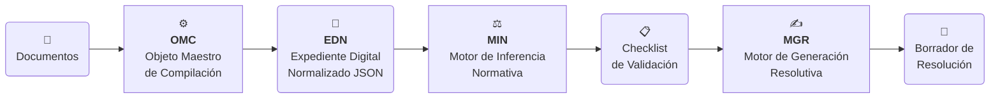

# Sistema de Análisis de Reclamos SEC


## 1. Propósito

Este repositorio contiene el código fuente del **Sistema de Análisis de Reclamos SEC**, una plataforma full-stack diseñada para la automatización y estandarización del proceso de fiscalización de reclamos técnicos. La solución implementa un flujo de trabajo digital que reduce la discrecionalidad, acelera los tiempos de respuesta y asegura la trazabilidad del proceso normativo, basado en los reglamentos de la Superintendencia de Electricidad y Combustibles (SEC).

El sistema transforma documentos no estructurados (PDFs, DOCX) en un **Expediente Digital Normalizado (EDN)**, evalúa su contenido contra reglas de negocio y genera borradores de resoluciones legales, optimizando significativamente el trabajo del fiscalizador.

## 2. Arquitectura de Motores

El sistema opera bajo un patrón **Pipeline & Filters**, donde cada motor especializado procesa y enriquece los datos para la siguiente etapa.



## 3. Módulos Principales (Core Engines)

-   **OMC (Objeto Maestro de Compilación):** Responsable de la ingesta de documentos, extracción de texto (OCR), clasificación documental y normalización de datos para generar el EDN, la fuente única de verdad del sistema.
-   **MIN (Motor de Inferencia Normativa):** Contiene la lógica de negocio. Evalúa el EDN contra un set de reglas configurables (basadas en la normativa SEC) para generar un checklist de validación detallado.
-   **MGR (Motor de Generación Resolutiva):** Motor de templating que ensambla dinámicamente borradores de documentos legales (Resoluciones) combinando plantillas maestras con los resultados del checklist.

## 4. Centro de Documentación

La documentación completa del proyecto está centralizada en el directorio `docs/`.

| Tipo | Documento | Descripción |
| :--- | :--- | :--- |
| 📘 **Arquitectura** | **[Manual de Ingeniería](./docs/manual_tecnico/0_Indice.md)** | Visión arquitectónica, principios de diseño y flujos de datos. |
| 💻 **Implementación** | **[Guía Full-Stack](./docs/full-stack/)** | Detalles técnicos del código Backend (FastAPI) y Frontend (Vue.js). |
| ⚖️ **Normativa** | **[Base de Conocimiento](./docs/sec/)** | Documentos oficiales (Manual de Reclamos 2025, Res. Ex. 1952) que sustentan la lógica del MIN. |

## 5. Estructura del Repositorio

```text
.
├── docs/
│   ├── manual_tecnico/   # 📘 Manual de Arquitectura y Diseño (Ingeniería Básica)
│   ├── full-stack/      # 💻 Documentación de Implementación (Backend/Frontend)
│   └── sec/             # ⚖️  Base Normativa (PDFs/JSON de reglamentos)
├── full-stack/          # 🚀 Código Fuente de la Aplicación
│   ├── backend/
│   └── frontend/
└── README.md            # 📍 Usted está aquí
```

## 6. Inicio Rápido (Quick Start)

**Pre-requisitos:** Python 3.11+, Node.js 18+.

### Backend (API)

```bash
cd full-stack/backend
pip install -r requirements.txt
python main.py
```
*Servidor disponible en `http://localhost:8000`*

### Frontend (UI)

```bash
cd full-stack/frontend
npm install
npm run dev
```
*Interfaz disponible en `http://localhost:5173`*

---
*Para una guía de instalación detallada, consulte la [documentación de implementación](./docs/full-stack/).*
