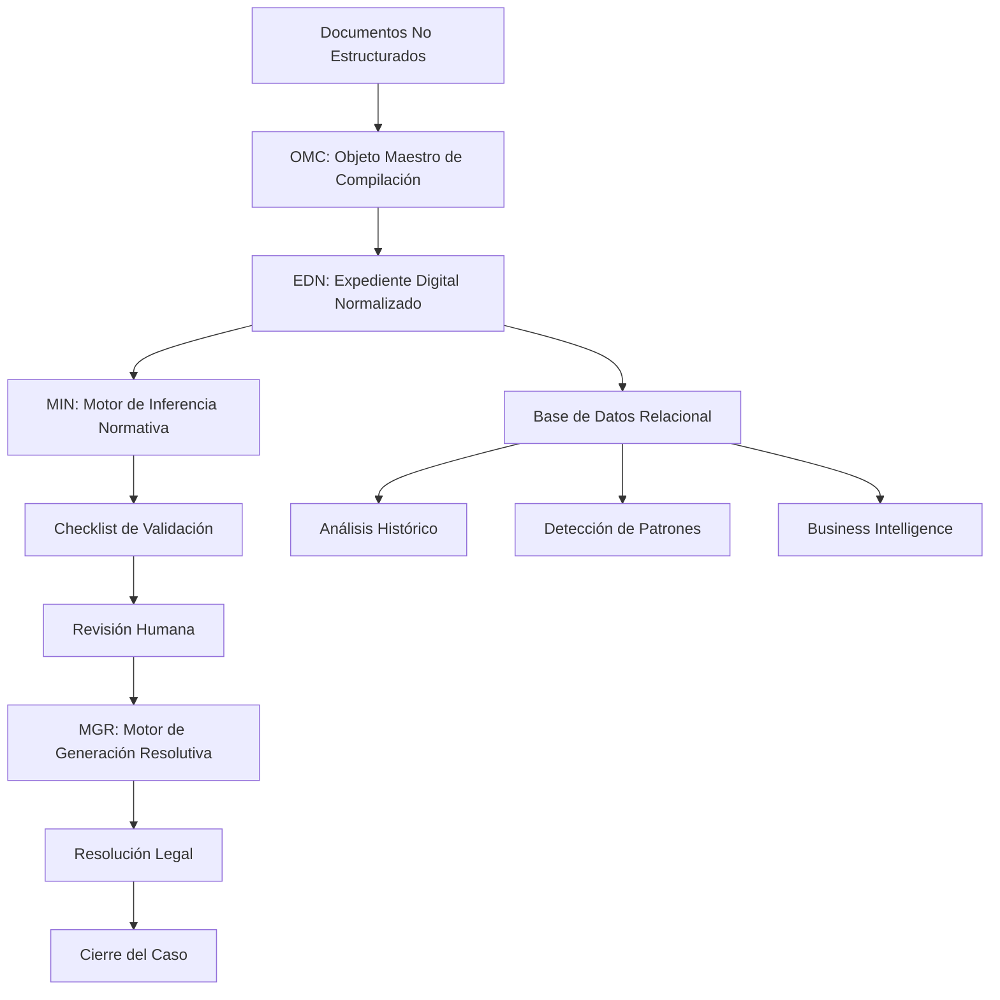

# Capítulo 1: Arquitectura General

[← Índice](0_Indice.md) | [Siguiente: Entradas →](2_Entradas.md)

## 1.1. Visión de Alto Nivel

El Sistema de Análisis de Reclamos SEC es una plataforma de procesamiento documental y análisis normativo diseñada para automatizar el flujo de trabajo de funcionarios que revisan reclamos de servicios eléctricos. El sistema transforma documentos no estructurados en decisiones legales estructuradas mediante un pipeline de procesamiento multi-etapa.

## 1.2. Diagrama de Flujo Arquitectónico

## 1.3. Flujo de Datos Principal

### Fase 1: Ingesta y Normalización (OMC)

**Entrada:**
- Archivos binarios (PDF, imágenes, documentos Word)
- Metadatos del caso (ID SEC, fecha de ingreso, empresa)

**Proceso:**
1. Sanitización de archivos (reparación, normalización de formatos)
2. Extracción de texto (OCR para imágenes, extracción directa para PDFs)
3. Clasificación documental (heurística multi-capa)
4. Extracción de entidades (RUT, NIS, direcciones, montos)
5. Consolidación en contexto unificado

**Salida:**
- Expediente Digital Normalizado (EDN) - JSON estructurado
- Registros en Base de Datos Relacional (Personas, Suministros, Casos, Documentos)

### Fase 2: Persistencia (Base de Datos)

**Entrada:**
- EDN generado por OMC
- Entidades extraídas (Persona, Suministro)

**Proceso:**
1. Resolución de entidades existentes (Upsert Inteligente)
2. Creación/actualización de registros relacionales
3. Indexación de documentos con metadatos

**Salida:**
- Base de datos normalizada con historial completo
- EDN almacenado como JSON separado

### Fase 3: Inferencia Normativa (MIN)

**Entrada:**
- EDN completo con inventario documental
- Configuración de checklist según tipo de caso (JSON)

**Proceso:**
1. Identificación del tipo de caso (CNR, CORTE_SUMINISTRO, etc.)
2. Carga de configuración de checklist correspondiente
3. Ejecución de reglas de validación (Python)
4. Evaluación de cumplimiento de requisitos

**Salida:**
- Checklist estructurado con estados (CUMPLE/NO_CUMPLE/REVISION_MANUAL)
- Evidencia identificada con deep linking a documentos

### Fase 4: Validación Humana (Interfaz de Usuario)

**Entrada:**
- Checklist generado por MIN
- EDN completo para visualización

**Proceso:**
1. Revisión de items del checklist por funcionario
2. Validación manual de evidencia
3. Corrección de clasificaciones erróneas
4. Edición de información contextual

**Salida:**
- Checklist validado por humano
- EDN actualizado con correcciones

### Fase 5: Generación de Resolución (MGR)

**Entrada:**
- Checklist validado
- Estado de cumplimiento de requisitos

**Proceso:**
1. Determinación del tipo de resolución (Instrucción/Improcedente)
2. Carga de plantilla master correspondiente
3. Inyección de snippets de argumentos legales según items fallidos
4. Generación de borrador completo

**Salida:**
- Borrador de resolución legal
- Documento listo para revisión y firma

### Fase 6: Cierre del Caso

**Entrada:**
- Resolución editada y aprobada por funcionario

**Proceso:**
1. Firma digital de la resolución
2. Actualización de estado del caso a CERRADO
3. Persistencia de resolución y fecha de cierre

**Salida:**
- Caso cerrado con resolución final
- Historial completo preservado en base de datos

## 1.4. Patrón de Diseño: Pipeline & Filters

El sistema implementa el patrón **Pipeline & Filters**, donde cada etapa del procesamiento es un filtro independiente que transforma datos y los pasa al siguiente filtro.

**Ventajas:**
- **Modularidad**: Cada filtro puede desarrollarse y testearse independientemente
- **Escalabilidad**: Fácil agregar nuevos filtros o modificar existentes
- **Paralelización**: Filtros independientes pueden ejecutarse en paralelo
- **Mantenibilidad**: Cambios en un filtro no afectan a otros

**Implementación:**
- Cada motor (OMC, MIN, MGR) es un filtro independiente
- El EDN actúa como el formato de datos estándar entre filtros
- La base de datos actúa como almacén persistente entre etapas

## 1.5. Arquitectura Hexagonal

El sistema sigue principios de **Arquitectura Hexagonal** (Ports & Adapters), separando la lógica de negocio de los detalles de implementación.

**Puertos (Interfaces):**
- **Puerto de Ingesta**: Define cómo se reciben documentos
- **Puerto de Persistencia**: Define cómo se almacenan datos
- **Puerto de Validación**: Define cómo se evalúan reglas
- **Puerto de Generación**: Define cómo se generan resoluciones

**Adaptadores (Implementaciones):**
- **Adaptador REST**: API FastAPI para ingesta HTTP
- **Adaptador JSON**: Gestor de base de datos JSON
- **Adaptador SQLite**: Gestor de base de datos SQLite (futuro)
- **Adaptador de Reglas**: Ejecutor de reglas Python desde JSON

**Ventajas:**
- **Testabilidad**: Lógica de negocio testeable sin dependencias externas
- **Flexibilidad**: Fácil cambiar adaptadores (JSON → SQLite → PostgreSQL)
- **Desacoplamiento**: Cambios en infraestructura no afectan lógica de negocio

## 1.6. Separación de Responsabilidades

### Automatización vs Intervención Humana

**Completamente Automatizado:**
- Sanitización y extracción de texto
- Clasificación documental inicial
- Extracción de entidades
- Generación de checklist
- Generación de borrador de resolución

**Human-in-the-Loop (Validación Humana):**
- Corrección de clasificaciones erróneas
- Validación de items del checklist
- Edición de información contextual
- Revisión y edición del borrador de resolución
- Firma y cierre del caso

**Principio de Diseño:**
El sistema automatiza todo lo posible, pero siempre permite al funcionario corregir, validar y sobreescribir decisiones automáticas. Esto garantiza precisión legal y responsabilidad humana en decisiones críticas.

## 1.7. Escalabilidad y Extensibilidad

### Soporte para Múltiples Tipos de Reclamos

El sistema está diseñado para soportar múltiples tipos de reclamos (CNR, CORTE_SUMINISTRO, DAÑO_EQUIPOS, etc.) mediante:

1. **Configuración por Tipo**: Cada tipo tiene su propio JSON de configuración de checklist
2. **Reglas Específicas**: Reglas Python específicas por tipo, con reglas base compartidas
3. **Clasificación Automática**: El OMC identifica automáticamente el tipo de caso

### Agregar Nuevo Tipo de Reclamo

**Pasos:**
1. Crear JSON de configuración en `templates/checklist/{nuevo_tipo}.json`
2. Implementar reglas específicas en `src/engine/min/rules/{nuevo_tipo}_rules.py`
3. Registrar reglas en `RULE_REGISTRY`
4. Actualizar clasificador en OMC para identificar el nuevo tipo

**Sin Modificar Código Existente:**
- La estructura de EDN permanece igual
- El flujo de procesamiento no cambia
- La interfaz de usuario se adapta automáticamente

## 1.8. Principios de Diseño Fundamentales

### Idempotencia
Procesar el mismo lote de archivos múltiples veces no debe crear duplicados. El sistema implementa lógica de upsert inteligente que detecta entidades existentes y las actualiza en lugar de duplicarlas.

### Tolerancia a Fallos
Un documento corrupto o ilegible no detiene el procesamiento del caso completo. El sistema marca documentos problemáticos y continúa con los demás, registrando errores en los metadatos del EDN.

### Trazabilidad Completa
Todo documento procesado queda indexado con metadatos de extracción. Cada entidad (Persona, Suministro) mantiene historial de todos sus casos relacionados.

### Separación de Estructura y Lógica
La estructura visual (checklist) está definida en JSONs configurables, mientras que la lógica de evaluación está en código Python. Esto permite modificar la estructura sin tocar código y viceversa.

## 1.9. Tecnologías y Stack

**Backend:**
- Python 3.11+ (lenguaje principal)
- FastAPI (framework web)
- Pydantic (validación de datos)
- SQLAlchemy (ORM opcional)

**Frontend:**
- Vue.js 3 (framework frontend)
- Vue Router (enrutamiento)
- Axios (cliente HTTP)

**Procesamiento:**
- pdfplumber (extracción de PDFs)
- pytesseract (OCR)
- Pillow (procesamiento de imágenes)
- python-docx (extracción de Word)

**Persistencia:**
- JSON (desarrollo actual)
- SQLite (opcional)
- PostgreSQL (producción futura)

## 1.10. Conclusión

La arquitectura del sistema está diseñada para ser modular, escalable y mantenible. La separación clara entre automatización y validación humana garantiza precisión legal mientras maximiza la eficiencia del funcionario. El patrón Pipeline & Filters y la Arquitectura Hexagonal proporcionan una base sólida para evolución futura.

---

[← Anterior: Índice](0_Indice.md) | [Siguiente: Entradas →](2_Entradas.md)

