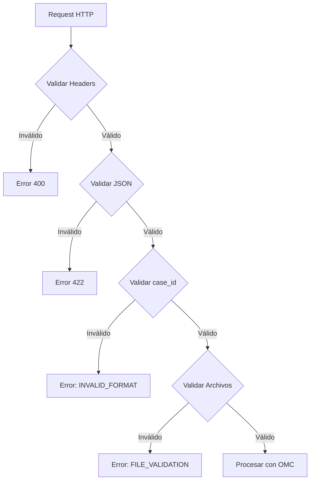

# Capítulo 2: Entradas

[← Anterior: Arquitectura General](1_Arquitectura_General.md) | [Siguiente: OMC →](3_OMC.md)

## 2.1. Contrato de Entrada

El sistema acepta documentos no estructurados y metadatos asociados a un caso de reclamo SEC. El contrato de entrada define qué tipos de archivos se aceptan, qué validaciones de seguridad se aplican, y qué estructura de metadatos se requiere.

## 2.2. Tipos de Archivos Aceptados

### 2.2.1. Formatos Soportados

**Documentos:**
- **PDF** (`.pdf`): Documentos nativos o escaneados
- **Word** (`.docx`): Documentos Office Open XML
- **Imágenes**: JPEG (`.jpg`, `.jpeg`), PNG (`.png`), TIFF (`.tiff`), BMP (`.bmp`)

**Restricciones:**
- Tamaño máximo: 50 MB por archivo (configurable)
- PDFs protegidos con contraseña: Requieren desbloqueo previo
- Archivos corruptos: Se intentan reparar automáticamente

### 2.2.2. Validaciones de Seguridad

**Validación de Tipo MIME:**
- Verificación de tipo MIME real del archivo (no solo extensión)
- Rechazo de archivos con tipo MIME no permitido
- Librería: `python-magic` o `filetype`

**Validación de Integridad:**
- Checksum SHA-256 para verificar integridad
- Detección de archivos corruptos o manipulados
- Rechazo de archivos con checksum inválido

**Validación de Contenido:**
- Detección de archivos vacíos
- Verificación de estructura interna (cabeceras PDF válidas)
- Rechazo de archivos que no pueden ser procesados

## 2.3. Estructura del Payload JSON

### 2.3.1. Endpoint de Ingesta

**Ruta:** `POST /api/ingestion/process-case`

**Headers:**
```
Content-Type: application/json
X-App-Mode: validate (opcional)
```

**Body:**
```json
{
  "case_id": "231220-000557",
  "case_metadata": {
    "origen": "SIAC",
    "fecha_ingreso": "2023-12-20",
    "empresa": "ENEL",
    "materia": "Facturación"
  },
  "files": [
    {
      "filename": "Respuesta_Reclamo_2642280.pdf",
      "content": "<base64_binary>",
      "mime_type": "application/pdf"
    },
    {
      "filename": "foto_medidor_1.jpg",
      "content": "<base64_binary>",
      "mime_type": "image/jpeg"
    }
  ]
}
```

### 2.3.2. Campos del Payload

**`case_id` (requerido):**
- Formato: `YYMMDD-XXXXXX` (formato SEC estándar)
- Validación: Regex `^\d{6}-\d{6}$`
- Debe ser único en el sistema

**`case_metadata` (requerido):**
- `origen`: Origen del caso (SIAC, Manual, etc.)
- `fecha_ingreso`: Fecha de ingreso en formato ISO 8601
- `empresa`: Nombre de la empresa distribuidora
- `materia`: Tipo de materia del reclamo (opcional)

**`files` (requerido, array):**
- `filename`: Nombre original del archivo
- `content`: Contenido binario codificado en Base64
- `mime_type`: Tipo MIME del archivo

## 2.4. Validaciones de Entrada

### 2.4.1. Validación de `case_id`

**Reglas:**
- Debe cumplir formato SEC: `YYMMDD-XXXXXX`
- No debe existir previamente (a menos que sea actualización)
- Validación de dígitos y formato

**Código de Ejemplo:**
```python
import re

def validate_case_id(case_id: str) -> bool:
    pattern = r'^\d{6}-\d{6}$'
    if not re.match(pattern, case_id):
        return False
    # Validar que fecha sea válida
    year = int(case_id[:2])
    month = int(case_id[2:4])
    day = int(case_id[4:6])
    # Validar rango de fecha
    return 1 <= month <= 12 and 1 <= day <= 31
```

### 2.4.2. Validación de Archivos

**Reglas por Archivo:**
- Tamaño máximo: 50 MB
- Tipo MIME permitido
- Contenido Base64 válido
- Archivo no vacío

**Procesamiento:**
1. Decodificar Base64
2. Verificar tamaño
3. Validar tipo MIME real
4. Guardar temporalmente para procesamiento

### 2.4.3. Validación de Metadatos

**Reglas:**
- `fecha_ingreso`: Debe ser fecha válida en formato ISO 8601
- `empresa`: Debe ser string no vacío
- `origen`: Debe estar en lista de orígenes permitidos

## 2.5. Restricciones de Ingesta

### 2.5.1. Límites de Volumen

**Por Caso:**
- Máximo 50 archivos por caso
- Tamaño total máximo: 500 MB por caso
- Tiempo máximo de procesamiento: 10 minutos

**Por Sistema:**
- Máximo 10 casos simultáneos en procesamiento
- Rate limiting: 100 requests por minuto por IP

### 2.5.2. Restricciones de Contenido

**Archivos Rechazados:**
- Archivos ejecutables (`.exe`, `.bat`, `.sh`)
- Scripts (`.js`, `.py`, `.rb`)
- Archivos comprimidos con contenido sospechoso
- Archivos con nombres que indican malware

**Validación de Seguridad:**
- Escaneo básico de contenido
- Detección de patrones sospechosos
- Cuarentena de archivos dudosos

## 2.6. Manejo de Errores de Entrada

### 2.6.1. Errores de Validación

**Respuesta de Error:**
```json
{
  "error": "VALIDATION_ERROR",
  "message": "El case_id no cumple el formato requerido",
  "field": "case_id",
  "code": "INVALID_FORMAT"
}
```

**Códigos de Error:**
- `INVALID_FORMAT`: Formato de campo inválido
- `FILE_TOO_LARGE`: Archivo excede tamaño máximo
- `INVALID_MIME_TYPE`: Tipo MIME no permitido
- `DUPLICATE_CASE_ID`: Case ID ya existe
- `INVALID_BASE64`: Contenido Base64 inválido

### 2.6.2. Errores de Procesamiento

**Respuesta Parcial:**
Si algunos archivos fallan pero otros se procesan correctamente:

```json
{
  "status": "PARTIAL_SUCCESS",
  "case_id": "231220-000557",
  "processed_files": 3,
  "failed_files": 1,
  "errors": [
    {
      "filename": "archivo_corrupto.pdf",
      "error": "PDF corrupto, no se pudo reparar"
    }
  ]
}
```

## 2.7. Alternativas de Ingesta

### 2.7.1. File Watcher (Opcional)

Para integración con sistemas externos, el sistema puede monitorear una carpeta `incoming/`:

**Configuración:**
- Ruta: `backend/data/incoming/`
- Polling cada 30 segundos
- Procesamiento automático de nuevos archivos

**Estructura Esperada:**
```
incoming/
  └── {case_id}/
      ├── metadata.json
      └── archivos/
          ├── documento1.pdf
          └── documento2.jpg
```

### 2.7.2. API REST (Principal)

El método principal de ingesta es mediante API REST con payload JSON y archivos en Base64.

**Ventajas:**
- Control total sobre el proceso
- Validación inmediata
- Respuesta síncrona con estado de procesamiento

## 2.8. Flujo de Validación de Entrada



## 2.9. Consideraciones de Seguridad

### 2.9.1. Sanitización de Nombres de Archivo

**Problema:**
Nombres de archivo pueden contener caracteres peligrosos o rutas relativas.

**Solución:**
- Remover caracteres especiales
- Normalizar a ASCII
- Generar nombres estandarizados seguros

### 2.9.2. Límites de Tiempo

**Timeouts:**
- Procesamiento de archivo individual: 5 minutos
- Procesamiento de caso completo: 10 minutos
- Timeout de request HTTP: 15 minutos

**Manejo:**
- Cancelación automática de procesos que exceden timeout
- Notificación de error al cliente
- Limpieza de archivos temporales

## 2.10. Conclusión

El contrato de entrada del sistema define claramente qué se acepta, cómo se valida, y qué restricciones se aplican. Las validaciones de seguridad y las restricciones de volumen garantizan que el sistema procese solo datos válidos y seguros, protegiendo la integridad del sistema y los datos almacenados.

---

[← Anterior: Arquitectura General](1_Arquitectura_General.md) | [Siguiente: OMC →](3_OMC.md)

