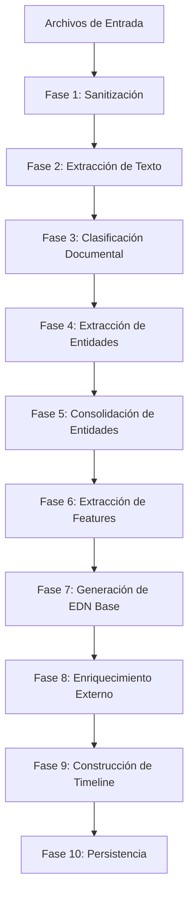

# Capítulo 3: OMC (Objeto Maestro de Compilación)

[← Anterior: Entradas](2_Entradas.md) | [Siguiente: DataBase →](4_DataBase.md)

## 3.1. Definición y Propósito

El **Objeto Maestro de Compilación (OMC)** es el núcleo del sistema de ingesta. Actúa como una "caja negra" que transforma documentos no estructurados y dispersos en dos salidas estructuradas y analizables:

1. **Base de Datos Relacional Normalizada**: Un esquema estrella que preserva la historia de actores (Personas, Suministros) y eventos (Casos).
2. **Expediente Digital Normalizado (EDN)**: Un contrato JSON estandarizado que alimenta todos los módulos posteriores de análisis.

## 3.2. Principios de Diseño

### 3.2.1. Idempotencia
Procesar el mismo lote de archivos múltiples veces no debe crear duplicados. El sistema implementa lógica de upsert inteligente que detecta entidades existentes y las actualiza en lugar de duplicarlas.

### 3.2.2. Tolerancia a Fallos
Un documento corrupto no detiene el procesamiento del caso completo. El sistema marca documentos problemáticos y continúa con los demás, registrando errores en los metadatos del EDN.

### 3.2.3. Extracción Específica por Tipo
Cada tipo de documento tiene un esquema de extracción único y campos específicos en la base de datos. Esto permite extraer información relevante según el tipo de documento.

### 3.2.4. Upsert Inteligente
Resolución automática de entidades existentes vs. nuevas. El sistema busca entidades por claves naturales (RUT para Personas, NIS+Comuna para Suministros) y actualiza en lugar de duplicar.

### 3.2.5. Traza Completa
Todo documento procesado queda indexado con metadatos de extracción. Cada entidad mantiene referencia a los documentos que la originaron.

## 3.3. Pipeline de Procesamiento

El OMC ejecuta un pipeline de 10 fases secuenciales:



## 3.4. Fase 1: Sanitización y Normalización

### 3.4.1. Objetivo
Convertir todos los formatos a estándares procesables y reparar documentos corruptos.

### 3.4.2. Sanitización de PDFs

**Problemas Comunes:**
- PDFs escaneados sin capa de texto (solo imágenes)
- PDFs con cabeceras corruptas
- PDFs con protección/contraseña
- PDFs con metadatos inconsistentes

**Proceso:**
1. **Validación de Estructura**: Verificar estructura interna usando `pypdf`
2. **Reparación de Cabeceras**: Usar `qpdf` (CLI) para reparar PDFs corruptos
3. **Detección de Capa de Texto**: 
   - Si existe capa de texto → Extracción directa
   - Si NO existe → Marcar para OCR posterior
4. **Conversión a PDF/A**: Usar `ghostscript` para normalización

**Salida:**
- PDF válido y normalizado
- Flag indicando si requiere OCR

### 3.4.3. Procesamiento de Imágenes

**Formatos Soportados:** JPEG, PNG, TIFF, BMP

**Normalización:**
- Conversión a PNG (formato sin pérdida)
- Redimensionamiento si > 4000px (optimización)
- Corrección de orientación (EXIF)
- Normalización de espacio de color (RGB)

**Librerías:**
- `Pillow (PIL)`: Procesamiento de imágenes
- `exifread`: Lectura de metadatos EXIF

### 3.4.4. Procesamiento de Documentos Word

**Formatos:** `.docx` (Office Open XML)

**Proceso:**
- Extracción directa de texto estructurado
- Preservación de metadatos (autor, fecha creación)
- Conversión de tablas a estructuras JSON

**Librería:** `python-docx`

## 3.5. Fase 2: Extracción de Texto (OCR & Text Extraction)

### 3.5.1. Extracción de PDFs con Capa de Texto

**Estrategia:**
- Usar `pdfplumber` para extracción de texto y tablas estructuradas
- Preservar coordenadas de texto (bbox) para deep linking
- Extraer metadatos (autor, fecha, título)

**Salida:**
- Texto completo del documento
- Texto por página con coordenadas
- Tablas extraídas como estructuras JSON
- Metadatos del documento

### 3.5.2. OCR para Imágenes y PDFs Escaneados

**Motor OCR:** Tesseract OCR con modelo de idioma español

**Configuración:**
- Idioma: `spa` (español)
- PSM (Page Segmentation Mode): Auto-detección
- OCR Engine Mode: LSTM (mejor precisión)

**Pre-procesamiento de Imagen:**
1. Conversión a escala de grises
2. Aplicación de filtro de desenfoque (Gaussian Blur)
3. Binarización (Threshold) adaptativa
4. Reducción de ruido (morphological operations)

**Librerías:**
- `pytesseract`: Wrapper de Tesseract OCR
- `opencv-python (cv2)`: Pre-procesamiento de imágenes
- `numpy`: Operaciones de arrays

**Manejo de PDFs Escaneados:**
- Convertir cada página a imagen (300 DPI)
- Aplicar OCR por página
- Reconstruir texto completo

## 3.6. Fase 3: Clasificación Documental Inteligente

### 3.6.1. Objetivo
Identificar el tipo de documento mediante análisis multi-capa (nombre, contenido, estructura).

### 3.6.2. Taxonomía de Documentos

La taxonomía define **no solo el tipo**, sino también **qué información debe extraerse** y **qué campos tendrá en la base de datos**.

| Tipo Documento | Nivel | Campos Específicos en BD | Relevancia Checklist |
|----------------|-------|-------------------------|---------------------|
| `CARTA_RESPUESTA` | Level 1 (Crítico) | `response_date`, `decision`, `resolution_number`, `cnr_reference` | ✅ Crítico: Define si el reclamo fue aceptado/rechazado |
| `ORDEN_TRABAJO` | Level 1 (Crítico) | `ot_number`, `technician_name`, `visit_date`, `findings`, `equipment_status` | ✅ Crítico: Evidencia técnica de terreno |
| `TABLA_CALCULO` | Level 1 (Crítico) | `total_amount`, `cim_kwh`, `period_start`, `period_end`, `calculation_method` | ✅ Crítico: Base del cálculo de facturación |
| `EVIDENCIA_FOTOGRAFICA` | Level 2 (Soportante) | `photo_count`, `tags`, `geolocation`, `timestamp` | ⚠️ Soportante: Corrobora hallazgos técnicos |
| `GRAFICO_CONSUMO` | Level 2 (Soportante) | `consumption_data`, `period_months`, `trend` | ⚠️ Soportante: Historial de consumo |
| `INFORME_CNR` | Level 2 (Soportante) | `cnr_number`, `installation_date`, `equipment_model` | ⚠️ Soportante: Especificaciones técnicas |
| `OTROS` | Level 2 (Soportante) | `generic_metadata` | ❌ No estructurado |

### 3.6.3. Algoritmo de Clasificación Multi-Capa

**Estrategia:** Combinar señales de múltiples fuentes con pesos configurables.

**Señales de Clasificación:**

1. **Análisis de Nombre de Archivo** (Peso: 0.3)
   - Patrones regex por tipo
   - Palabras clave en nombre
   - Nomenclatura estandarizada

2. **Análisis de Contenido** (Peso: 0.5)
   - Presencia de frases clave
   - Estructura de documento (encabezados, tablas)
   - Densidad de términos técnicos

3. **Análisis Estructural** (Peso: 0.2)
   - Presencia de tablas (indica `TABLA_CALCULO`)
   - Presencia de imágenes (indica `EVIDENCIA_FOTOGRAFICA`)
   - Número de páginas

**Salida:**
- Tipo de documento identificado
- Nivel de confianza (0.0-1.0)
- Si confianza < 0.6, marcar como `OTROS`

### 3.6.4. Clasificación de Tipo de Caso

El OMC también determina el **tipo de caso** (CNR, CORTE_SUMINISTRO, etc.) basado en los documentos presentes:

**Heurísticas:**
- Si hay `ORDEN_TRABAJO` y `TABLA_CALCULO` → `CNR`
- Si hay documentos con "corte" en nombre → `CORTE_SUMINISTRO`
- Si hay `EVIDENCIA_FOTOGRAFICA` con tags de "daño" → `DAÑO_EQUIPOS`

**Salida:**
- `tipo_caso` guardado en `EDN.compilation_metadata.tipo_caso`

## 3.7. Fase 4: Extracción de Entidades Específicas por Tipo

### 3.7.1. Principio Clave
Cada tipo de documento tiene un **esquema de extracción único** que define qué campos se buscan y cómo se almacenan en la base de datos.

### 3.7.2. Extracción Genérica (Entidades Maestras)

**Entidades que se buscan en TODOS los documentos:**
- **RUT**: Patrón `\d{1,2}\.\d{3}\.\d{3}-[\dkK]`
- **NIS/Número Cliente**: Patrón `(?:nis|cliente\s*n[°º]?)\s*(\d{4,10})`
- **Dirección**: Patrón `(?:av\.?|avenida|calle)\s+[^,\n]+`
- **Comuna**: Lista de comunas conocidas
- **Monto**: Patrón `\$?\s*(\d{1,3}(?:\.\d{3})*(?:,\d+)?)`

### 3.7.3. Extracción Específica: CARTA_RESPUESTA

**Campos a Extraer:**
- `response_date`: Fecha de respuesta
- `decision`: Decisión (PROCEDENTE, IMPROCEDENTE, RECHAZADO, ACEPTADO)
- `resolution_number`: Número de resolución
- `cnr_reference`: Referencia CNR
- `legal_basis`: Base legal citada

**Método:**
- Búsqueda de patrones regex en el contenido
- Normalización de fechas y valores
- Validación de formatos

### 3.7.4. Extracción Específica: TABLA_CALCULO

**Campos a Extraer:**
- `total_amount`: Monto total
- `cim_kwh`: Consumo Índice Mensual en kWh
- `period_start`: Inicio del período
- `period_end`: Fin del período
- `calculation_method`: Método de cálculo (PROMEDIO, MEDIANA, ESTIMADO)
- `table_data`: Tabla completa como JSON

**Método:**
- Extracción de tablas usando `pdfplumber`
- Búsqueda de filas con "Total" o "CIM"
- Parsing de valores numéricos y fechas

### 3.7.5. Extracción Específica: ORDEN_TRABAJO

**Campos a Extraer:**
- `ot_number`: Número de orden de trabajo
- `technician_name`: Nombre del técnico
- `visit_date`: Fecha de visita
- `findings`: Hallazgos técnicos
- `equipment_status`: Estado del equipo (OPERATIVO, DEFECTUOSO, SIN_SELLO)
- `recommendations`: Recomendaciones

**Método:**
- Búsqueda de secciones específicas ("Hallazgos", "Recomendaciones")
- Extracción de campos estructurados
- Parsing de fechas y estados

### 3.7.6. Extracción Específica: EVIDENCIA_FOTOGRAFICA

**Campos a Extraer:**
- `photo_count`: Cantidad de fotos
- `tags`: Etiquetas de contenido (medidor, sello, fachada)
- `geolocation`: Coordenadas GPS (si disponibles en EXIF)
- `timestamp`: Fecha y hora de captura

**Método:**
- Lectura de metadatos EXIF
- Análisis de contenido con Computer Vision (opcional)
- Detección de objetos (medidor, sello)

## 3.8. Fase 5: Consolidación de Entidades

### 3.8.1. Objetivo
Consolidar entidades extraídas de múltiples documentos en un contexto unificado (RUT, NIS, direcciones, etc.).

### 3.8.2. Proceso

**Entrada:**
- Lista de entidades extraídas de cada documento

**Proceso:**
1. Agrupar entidades por tipo (RUTs, NISs, direcciones)
2. Resolver conflictos (tomar el más frecuente o el de mayor confianza)
3. Normalizar formatos (RUT con puntos y guión, direcciones estandarizadas)
4. Consolidar en `unified_context`

**Salida:**
- `unified_context` con valores consolidados:
  - `rut_client`: RUT normalizado
  - `client_name`: Nombre del cliente
  - `service_nis`: NIS del suministro
  - `address_standard`: Dirección estandarizada
  - `commune`: Comuna
  - `email`, `phone`: Datos de contacto

## 3.9. Fase 6: Extracción de Features (Arquitectura Fact-Centric)

### 3.9.1. Objetivo
Extraer y consolidar variables de negocio (features) desde todos los documentos, transformando la arquitectura de "centrada en documentos" a **"centrada en hechos" (Fact-Centric)**.

### 3.9.2. Módulos de Extracción

#### `fact_extractor.py`

**Funciones Principales:**

1. **`extraer_desde_texto()`**: Analiza el texto normalizado e identifica:
   - Período del CNR (meses)
   - Fechas de inicio y término
   - Origen de la irregularidad (bypass, medidor defectuoso, etc.)
   - Historial de 12 meses disponible
   - Gráfico de consumo
   - Fotos de irregularidad
   - Monto CNR
   - Notificación previa
   - Constancia notarial
   - Certificado de laboratorio

2. **`construir_features()`**: Orquesta la extracción desde múltiples fuentes:
   - Une información desde texto, boletas y fotos
   - Prioriza fuentes según confiabilidad
   - Retorna `features` consolidados y `mapa_evidencias`

**Estrategia de Extracción:**
- Usa patrones regex para buscar fechas, montos, palabras clave
- Extrae snippets de texto con contexto para trazabilidad
- Vincula cada feature con su fuente exacta (documento, página, coordenadas)

#### `strategy_selector.py`

**Función Principal:**

**`extraer_desde_fuentes()`**: Decide desde dónde obtener el gráfico de consumo y otros datos usando heurísticas de fallback:

1. **Estrategia 1**: Buscar gráfico en Informe Técnico
2. **Estrategia 2**: Si no está en informe, buscar en Fotos
3. **Estrategia 3**: Si no está en fotos, activar módulo de boleta/webscraping

**Ejemplo de Heurística:**
```
Si el sistema detecta que el gráfico ya viene en el informe o en las fotos del expediente,
no usa la boleta. Si no se encuentra el gráfico, entonces activa el módulo de boleta/webscraping
para extraerlo desde allí.
```

### 3.9.3. Salida de la Fase 6

**`consolidated_facts` (alias: `features`):**
Objeto plano con variables de negocio ya destiladas:
```json
{
  "periodo_meses": 6,
  "origen": "conexion_irregular",
  "tiene_grafico_consumo": true,
  "monto_cnr": 86500,
  ...
}
```

**`evidence_map` (alias: `evidencias`):**
Mapa que vincula cada feature con su fuente:
```json
{
  "periodo_meses": [
    {
      "tipo": "texto",
      "documento": "Informe_Tecnico.pdf",
      "pagina": 2,
      "snippet": "el periodo comprendido entre 10-09-2023 y 15-05-2024"
    }
  ],
  ...
}
```

### 3.9.4. Integración con Pipeline

La Fase 6 se ejecuta después de la consolidación de entidades y antes de la generación del EDN. Esto permite que el EDN incluya tanto el inventario documental tradicional como los features consolidados, facilitando que el MIN opere de manera eficiente.

## 3.10. Fase 7: Generación del Expediente Digital Normalizado (EDN)

### 3.10.1. Objetivo
Construir el EDN completo que servirá como contrato de datos para los módulos posteriores.

### 3.10.2. Estructura del EDN

**Componentes:**
1. **`compilation_metadata`**: Metadatos del procesamiento
2. **`unified_context`**: Contexto consolidado
3. **`document_inventory`**: Inventario de documentos por nivel
4. **`consolidated_facts`**: Features consolidados (nuevo - fact-centric)
5. **`evidence_map`**: Mapa de evidencias (nuevo - fact-centric)
6. **`materia`**, `monto_disputa`, `empresa`, `fecha_ingreso`: Metadatos del caso
7. **`alertas`**: Alertas y advertencias

### 3.9.3. Organización de Documentos por Nivel

**Level 1 - Críticos:**
- Documentos esenciales para el análisis
- `CARTA_RESPUESTA`, `ORDEN_TRABAJO`, `TABLA_CALCULO`

**Level 2 - Soportantes:**
- Documentos complementarios
- `EVIDENCIA_FOTOGRAFICA`, `GRAFICO_CONSUMO`, `INFORME_CNR`

**Level 0 - Ausentes:**
- Documentos requeridos que no se encontraron
- Alertas de documentos faltantes

### 3.9.4. Detección de Documentos Faltantes

**Proceso:**
1. Definir tipos requeridos según tipo de caso
2. Comparar con tipos encontrados
3. Generar alertas para tipos faltantes

**Salida:**
- Lista de documentos faltantes en `level_0_missing`
- Nivel de alerta (HIGH, MEDIUM, LOW)

## 3.11. Fase 8: Enriquecimiento Externo (Scraping PIP)

### 3.11.1. Objetivo
Descargar boletas oficiales desde portales PIP (Plataforma de Información Pública) para contrastar con los documentos subidos por el usuario, transformando el sistema de revisor pasivo a auditor activo.

### 3.11.2. Patrón Strategy

**Arquitectura:**
- `base_scraper.py`: Interfaz abstracta que define el contrato para todos los scrapers
- `pip_manager.py`: Orquestador que coordina múltiples scrapers según la empresa
- Implementaciones específicas: `pip_enel_scraper.py`, `pip_cge_scraper.py`, etc.

**Métodos de BaseScraper:**
- `validate_credentials()`: Valida credenciales para acceder al portal
- `get_available_periods(nis)`: Obtiene períodos disponibles para un NIS
- `download_boleta(nis, period, output_path)`: Descarga una boleta específica

### 3.11.3. Lógica de Ejecución

**Trigger:**
- Si `unified_context.service_nis` y `empresa` están presentes → Invoca `PIPManager`

**Proceso:**
1. `PIPManager` busca scraper para la empresa detectada
2. Valida credenciales (si falla, continúa sin scraping)
3. Obtiene períodos disponibles (últimos 12 meses por defecto)
4. Descarga boletas en directorio temporal
5. **Re-inyección**: Cada PDF descargado se re-inyecta en `process_file()` para pasar por:
   - OCR y extracción de texto
   - Clasificación documental
   - Extracción de entidades
   - Clasificación por nivel

**Marcado de Provenance:**
- Documentos descargados se marcan con `provenance: 'SYSTEM_RETRIEVAL'`
- Esto permite que el MIN sepa qué documento tiene mayor jerarquía probatoria

### 3.11.4. Manejo de Errores Silencioso

**Principio:** El scraping debe fallar silenciosamente para no interrumpir el pipeline.

**Implementación:**
- Errores se registran como `warnings` en logs
- Si falla la descarga, el flujo continúa normalmente
- El sistema es robusto ante caídas de portales externos
- Solo se registra un `warning` en metadatos del EDN

**Ejemplo:**
```python
try:
    downloaded_files = pip_manager.enrich_case(company, nis, output_dir)
except Exception as e:
    logger.warning(f"Error en enriquecimiento externo: {e}")
    # Continuar sin scraping
```

### 3.11.5. Ciclo de Re-ingesta

Los PDFs descargados **no se guardan estáticos**. Se re-inyectan en el pipeline completo:

1. PDF descargado → `process_file()`
2. Pasa por OCR y extracción
3. Se clasifica y extrae entidades
4. Se agrega al `document_inventory` con `provenance: SYSTEM_RETRIEVAL`
5. Enriquece automáticamente el EDN con información adicional

**Ventaja:** Los documentos oficiales se procesan igual que los subidos por el usuario, garantizando consistencia.

## 3.12. Fase 9: Construcción de Timeline

### 3.12.1. Objetivo
Construir una línea temporal del caso extrayendo fechas clave para detectar silencios administrativos o cobros retroactivos ilegales.

### 3.12.2. Lógica de Construcción

**Función:** `build_timeline(edn) -> Dict`

**Proceso:**
1. Barre recursivamente `unified_context` y `document_inventory` buscando fechas clave:
   - `fecha_reclamo` (fecha de ingreso)
   - `fecha_respuesta` (desde CARTA_RESPUESTA)
   - `fecha_inspeccion` (desde ORDEN_TRABAJO)
   - `periodo_cobro_inicio` y `periodo_cobro_fin` (desde TABLA_CALCULO o `consolidated_facts`)

2. Genera lista ordenada de eventos:
   ```json
   [
     {
       "date": "2023-05-10",
       "event": "Inspección Técnica",
       "source_doc": "uuid-123",
       "type": "inspeccion",
       "delta_days": 45
     },
     ...
   ]
   ```

3. Calcula deltas entre eventos críticos:
   - Reclamo → Respuesta (debe ser ≤ 30 días)
   - Inspección → Inicio de cobro
   - Duración del período de cobro (debe ser ≤ 12 meses)

4. Detecta anomalías:
   - **Silencio administrativo**: Delta reclamo → respuesta > 30 días
   - **Periodo retroactivo ilegal**: Periodo de cobro > 12 meses

### 3.12.3. Estructura de Salida

El resultado se guarda en `edn.temporal_analysis`:

```json
{
  "events": [
    {
      "date": "2023-05-10",
      "event": "Ingreso del Reclamo",
      "source_doc": null,
      "type": "reclamo"
    },
    {
      "date": "2023-06-25",
      "event": "Respuesta de la Empresa",
      "source_doc": "uuid-123",
      "type": "respuesta",
      "delta_days": 45
    }
  ],
  "critical_deltas": {
    "reclamo_to_respuesta": 45,
    "inspeccion_to_cobro": 120,
    "periodo_cobro_meses": 6.5
  },
  "warnings": [
    "Silencio administrativo detectado: 45 días entre reclamo y respuesta (límite: 30 días)",
    "Periodo retroactivo excede 12 meses: 18.5 meses"
  ],
  "incomplete": false
}
```

### 3.12.4. Robustez

- Funciona aunque falten fechas (marca `incomplete: true`)
- Parsea múltiples formatos de fecha
- Maneja errores de parsing sin fallar
- Genera warnings descriptivos para fechas faltantes

## 3.13. Fase 10: Persistencia en Base de Datos

### 3.13.1. Proceso de Upsert

**Entrada:**
- EDN completo con entidades consolidadas

**Proceso:**
1. **Resolución de PERSONA:**
   - Buscar por RUT en tabla `personas`
   - Si existe: Actualizar datos de contacto
   - Si no existe: Crear nuevo registro
   
2. **Resolución de SUMINISTRO:**
   - Buscar por NIS+Comuna en tabla `suministros`
   - Si existe: Actualizar dirección si es más completa
   - Si no existe: Crear nuevo registro
   
3. **Registro del CASO:**
   - Crear/actualizar registro en tabla `casos`
   - Vincular con `persona_id` y `suministro_id`
   - Guardar EDN completo en `edn_json`
   
4. **Indexación Documental:**
   - Insertar registros en tabla `documentos`
   - Guardar `extracted_data` específico por tipo como JSONB
   - Guardar metadatos y rutas de archivos

**Salida:**
- Base de datos actualizada con historial preservado
- Relaciones entre entidades establecidas

## 3.14. Manejo de Errores y Casos Edge

### 3.14.1. Estrategia de Tolerancia a Fallos

**Principio:** Un documento fallido no debe detener el procesamiento del caso completo.

**Implementación:**
- Try-catch alrededor de procesamiento de cada archivo
- Registro de errores en metadatos del EDN
- Continuación con siguiente archivo
- Estado final: `COMPLETED` o `COMPLETED_WITH_WARNINGS`

### 3.14.2. Validación de Integridad Post-Procesamiento

**Validaciones:**
1. **RUT válido**: Verificar dígito verificador
2. **NIS válido**: Rango numérico razonable
3. **Fechas consistentes**: `fecha_ingreso` <= `response_date` (si existe)
4. **Montos razonables**: Entre 1.000 y 10.000.000 CLP
5. **Documentos críticos**: Al menos uno de `CARTA_RESPUESTA` o `TABLA_CALCULO`

## 3.15. Librerías y Tecnologías

| Componente | Librería | Versión Mínima | Propósito |
|------------|----------|----------------|-----------|
| **PDF Processing** | `pdfplumber` | 0.9.0 | Extracción de texto y tablas |
| **PDF Validation** | `pypdf` | 3.0.0 | Validación y reparación |
| **OCR** | `pytesseract` | 0.3.10 | Reconocimiento óptico de caracteres |
| **Image Processing** | `Pillow` | 10.0.0 | Procesamiento de imágenes |
| **Computer Vision** | `opencv-python` | 4.8.0 | Análisis de imágenes |
| **Word Documents** | `python-docx` | 1.1.0 | Lectura de documentos Word |
| **Regex** | `regex` | 2023.0.0 | Expresiones regulares avanzadas |
| **Date Parsing** | `dateutil` | 2.8.0 | Parsing flexible de fechas |
| **Web Scraping** | `playwright` o `selenium` | Latest | Scraping de portales PIP |
| **HTML Parsing** | `beautifulsoup4` | 4.12.0 | Parsing de HTML |
| **HTTP Requests** | `requests` | 2.31.0 | Descarga de archivos |

**Herramientas Externas (CLI):**
- **qpdf**: Reparación de PDFs corruptos
- **ghostscript**: Conversión a PDF/A
- **tesseract-ocr**: Motor OCR (requiere instalación del sistema)

## 3.16. Conclusión

El OMC es el corazón del sistema de ingesta. Su diseño permite transformar documentos no estructurados en datos analizables, construir una base de datos histórica que preserva la relación entre actores y eventos, y generar un contrato de datos estandarizado (EDN) que alimenta todos los módulos posteriores. La clave del éxito está en reconocer que cada tipo de documento tiene información única y diseñar el sistema para extraer y almacenar esa información de manera estructurada y consultable.

---

[← Anterior: Entradas](2_Entradas.md) | [Siguiente: DataBase →](4_DataBase.md)

