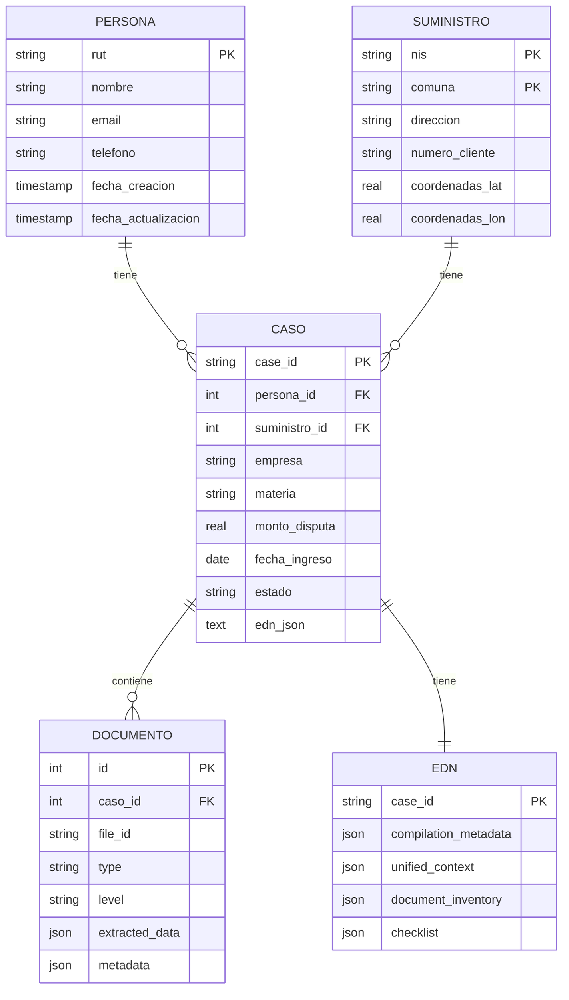

# Capítulo 4: DataBase

[← Anterior: OMC](3_OMC.md) | [Siguiente: EDN →](5_EDN.md)

## 4.1. Visión General

La base de datos del sistema implementa un **Modelo Relacional Estrella** diseñado para preservar la historia completa de actores (Personas, Suministros) y eventos (Casos). Este diseño permite análisis histórico, detección de patrones y trazabilidad completa de todos los reclamos procesados.

## 4.2. Modelo de Datos: Esquema Estrella

### 4.2.1. Concepto de Esquema Estrella

El esquema estrella separa los datos en:
- **Hechos (Facts)**: Eventos temporales (Casos)
- **Dimensiones (Dimensions)**: Entidades persistentes (Personas, Suministros)

**Ventajas:**
- Consultas analíticas eficientes
- Historial preservado de actores
- Detección de reincidencias
- Análisis longitudinal

### 4.2.2. Diagrama del Esquema



## 4.3. Tablas del Esquema

### 4.3.1. Tabla PERSONAS

**Propósito:** Almacenar información de clientes identificados por RUT.

**Estructura:**
```sql
CREATE TABLE personas (
    id INTEGER PRIMARY KEY AUTOINCREMENT,
    rut TEXT UNIQUE NOT NULL,  -- Clave natural
    nombre TEXT,
    email TEXT,
    telefono TEXT,
    fecha_creacion TIMESTAMP DEFAULT CURRENT_TIMESTAMP,
    fecha_actualizacion TIMESTAMP DEFAULT CURRENT_TIMESTAMP,
    
    INDEX idx_rut (rut)
);
```

**Características:**
- **Clave Primaria Natural**: RUT (único por persona)
- **Historial de Contacto**: Email y teléfono pueden actualizarse
- **Relación 1:N**: Una persona puede tener múltiples casos

**Justificación:**
Permite rastrear el historial completo de reclamos de un cliente, detectar reincidencias y mantener información de contacto actualizada.

### 4.3.2. Tabla SUMINISTROS

**Propósito:** Almacenar información de puntos de suministro (activos físicos).

**Estructura:**
```sql
CREATE TABLE suministros (
    id INTEGER PRIMARY KEY AUTOINCREMENT,
    nis TEXT NOT NULL,
    comuna TEXT NOT NULL,
    direccion TEXT,
    numero_cliente TEXT,
    coordenadas_lat REAL,
    coordenadas_lon REAL,
    fecha_creacion TIMESTAMP DEFAULT CURRENT_TIMESTAMP,
    
    UNIQUE(nis, comuna),  -- Clave única compuesta
    
    INDEX idx_nis (nis),
    INDEX idx_comuna (comuna)
);
```

**Características:**
- **Clave Primaria Compuesta**: NIS + Comuna (un suministro puede moverse)
- **Georreferenciación**: Coordenadas para análisis geográfico
- **Relación 1:N**: Un suministro puede tener múltiples casos

**Justificación:**
Crítico para detectar reincidencia de fraudes en una ubicación física, independientemente del habitante. Permite análisis geográfico de patrones de fraude.

### 4.3.3. Tabla CASOS

**Propósito:** Almacenar metadatos de casos de reclamos (eventos temporales).

**Estructura:**
```sql
CREATE TABLE casos (
    id INTEGER PRIMARY KEY AUTOINCREMENT,
    case_id TEXT UNIQUE NOT NULL,  -- Clave natural SEC
    persona_id INTEGER NOT NULL,
    suministro_id INTEGER NOT NULL,
    empresa TEXT,
    materia TEXT,
    monto_disputa REAL,
    fecha_ingreso DATE,
    fecha_cierre DATE,
    estado TEXT DEFAULT 'PENDIENTE',
    fecha_creacion TIMESTAMP DEFAULT CURRENT_TIMESTAMP,
    fecha_actualizacion TIMESTAMP DEFAULT CURRENT_TIMESTAMP,
    
    FOREIGN KEY (persona_id) REFERENCES personas(id),
    FOREIGN KEY (suministro_id) REFERENCES suministros(id),
    
    INDEX idx_case_id (case_id),
    INDEX idx_persona (persona_id),
    INDEX idx_suministro (suministro_id),
    INDEX idx_estado (estado)
);
```

**Características:**
- **Clave Primaria Natural**: `case_id` (formato SEC: YYMMDD-XXXXXX)
- **Relaciones**: Vincula Persona y Suministro
- **Estados**: PENDIENTE, EN_REVISION, RESUELTO, CERRADO
- **Metadatos**: Empresa, materia, monto en disputa

**Nota sobre EDN:**
El EDN completo se almacena separadamente en `edn.json` (ver sección 4.4). La tabla `casos` solo contiene metadatos para consultas rápidas.

### 4.3.4. Tabla DOCUMENTOS

**Propósito:** Índice de todos los documentos procesados con datos específicos por tipo.

**Estructura:**
```sql
CREATE TABLE documentos (
    id INTEGER PRIMARY KEY AUTOINCREMENT,
    caso_id INTEGER NOT NULL,
    file_id TEXT UNIQUE NOT NULL,  -- UUID interno
    original_name TEXT NOT NULL,
    standardized_name TEXT,
    type TEXT NOT NULL,  -- CARTA_RESPUESTA, TABLA_CALCULO, etc.
    level TEXT,  -- level_1_critical, level_2_supporting
    file_path TEXT,  -- Ruta relativa al storage
    file_size INTEGER,
    mime_type TEXT,
    
    -- Campo JSONB con datos específicos por tipo
    extracted_data JSON,  -- SQLite JSON o PostgreSQL JSONB
    
    -- Metadatos genéricos
    metadata JSON,
    
    -- Timestamps
    fecha_creacion TIMESTAMP DEFAULT CURRENT_TIMESTAMP,
    fecha_actualizacion TIMESTAMP DEFAULT CURRENT_TIMESTAMP,
    
    FOREIGN KEY (caso_id) REFERENCES casos(id),
    
    INDEX idx_caso (caso_id),
    INDEX idx_type (type),
    INDEX idx_file_id (file_id)
);
```

**Características:**
- **Datos Específicos por Tipo**: Campo `extracted_data` JSONB con esquema según tipo
- **Flexibilidad**: Nuevos tipos de documentos no requieren cambios de esquema
- **Consultas Analíticas**: PostgreSQL JSONB permite consultas eficientes sobre campos específicos

**Ejemplos de `extracted_data`:**

**CARTA_RESPUESTA:**
```json
{
  "response_date": "2023-12-21",
  "decision": "IMPROCEDENTE",
  "resolution_number": "12345",
  "cnr_reference": "231220-000557"
}
```

**TABLA_CALCULO:**
```json
{
  "total_amount": 150000.0,
  "cim_kwh": 450.5,
  "period_start": "2023-10-01",
  "period_end": "2023-12-31",
  "calculation_method": "PROMEDIO"
}
```

## 4.4. Separación de EDN y Metadatos

### 4.4.1. Diseño Clave

Los EDNs (Expedientes Digitales Normalizados) se almacenan **separadamente** de los metadatos del caso:

- **`casos.json`**: Metadatos del caso (sin EDN embebido)
- **`edn.json`**: EDNs completos indexados por `case_id`

### 4.4.2. Justificación de la Separación

**Ventajas:**

1. **Rendimiento:**
   - Consultas de lista (Dashboard) no cargan EDN completo
   - Solo se carga EDN cuando se abre un caso específico
   - Reducción significativa de tiempo de respuesta

2. **Modularidad:**
   - Actualizaciones de EDN independientes de metadatos
   - Versionado de EDN sin afectar metadatos
   - Facilita migración futura a base de datos relacional

3. **Auditoría:**
   - Historial de cambios en EDN separado
   - Metadatos del caso más estables
   - Trazabilidad de modificaciones

4. **Escalabilidad:**
   - EDNs pueden almacenarse en sistema de archivos o blob storage
   - Metadatos en base de datos relacional para consultas rápidas
   - Separación de concerns

### 4.4.3. Estructura de `edn.json`

```json
{
  "231220-000557": {
    "compilation_metadata": { ... },
    "unified_context": { ... },
    "document_inventory": { ... },
    "checklist": { ... },
    "materia": "Facturación",
    "monto_disputa": 150000.0,
    "empresa": "ENEL",
    "fecha_ingreso": "2023-12-20"
  }
}
```

**Clave:** `case_id` (coincide con `casos.json`)

**Relación:** 1:1 con `casos.json` (un caso tiene un EDN)

## 4.5. Estrategia de Upsert Inteligente

### 4.5.1. Principio

Al procesar un nuevo caso, el sistema **no debe duplicar** entidades existentes. Debe aplicar lógica de upsert (insert or update) que detecta entidades existentes y las actualiza en lugar de duplicarlas.

### 4.5.2. Resolución de PERSONA

**Input:** RUT extraído del EDN

**Lógica:**
1. Buscar RUT en tabla `personas`
2. **Si existe:**
   - Actualizar datos de contacto (Email/Teléfono) si los nuevos son más recientes
   - Obtener `persona_id` existente
3. **Si no existe:**
   - Crear nuevo registro de Persona
   - Obtener `persona_id` nuevo

**Código de Ejemplo:**
```python
def upsert_persona(rut: str, nombre: str = None, 
                   email: str = None, telefono: str = None) -> int:
    conn = get_connection()
    cursor = conn.cursor()
    
    # Buscar existente
    cursor.execute("SELECT id FROM personas WHERE rut = ?", (rut,))
    existing = cursor.fetchone()
    
    if existing:
        persona_id = existing[0]
        # Actualizar solo si nuevos datos son más recientes
        updates = []
        params = []
        
        if nombre:
            updates.append("nombre = ?")
            params.append(nombre)
        if email:
            updates.append("email = COALESCE(?, email)")  # Solo actualizar si no existe
            params.append(email)
        
        if updates:
            params.append(persona_id)
            cursor.execute(
                f"UPDATE personas SET {', '.join(updates)}, "
                "fecha_actualizacion = CURRENT_TIMESTAMP WHERE id = ?",
                params
            )
    else:
        # Insertar nuevo
        cursor.execute("""
            INSERT INTO personas (rut, nombre, email, telefono)
            VALUES (?, ?, ?, ?)
        """, (rut, nombre, email, telefono))
        persona_id = cursor.lastrowid
    
    conn.commit()
    return persona_id
```

### 4.5.3. Resolución de SUMINISTRO

**Input:** NIS y Comuna extraídos del EDN

**Lógica:**
1. Buscar NIS+Comuna en tabla `suministros`
2. **Si existe:**
   - Actualizar dirección si es más completa
   - Vincular caso a `suministro_id` existente
3. **Si no existe:**
   - Crear nuevo Punto de Suministro
   - Obtener `suministro_id` nuevo

**Justificación:**
Permite ver el historial de problemas de ese medidor/casa, independientemente del cliente actual.

### 4.5.4. Registro del CASO

**Input:** `case_id`, `persona_id`, `suministro_id`, metadatos del caso

**Lógica:**
1. Buscar `case_id` en tabla `casos`
2. **Si existe:**
   - Actualizar `fecha_actualizacion`
   - Actualizar `edn_json` si hay cambios
3. **Si no existe:**
   - Crear nuevo registro vinculando `persona_id` y `suministro_id`
   - Guardar metadatos y referencia a EDN

### 4.5.5. Indexación Documental

**Input:** Lista de documentos del `document_inventory`

**Lógica:**
1. Para cada documento:
   - Buscar `file_id` en tabla `documentos` para el caso
   - **Si existe:** Actualizar metadatos
   - **Si no existe:** Insertar nuevo registro
2. Guardar `extracted_data` específico por tipo como JSONB
3. Guardar metadatos y rutas de archivos

## 4.6. Ventajas del Diseño

### 4.6.1. Idempotencia

Procesar el mismo lote de archivos múltiples veces no crea duplicados. El sistema detecta entidades existentes y las actualiza, garantizando consistencia de datos.

### 4.6.2. Historial Preservado

- **Personas**: Mantienen historial de todos sus reclamos
- **Suministros**: Mantienen historial de problemas en esa ubicación
- **Casos**: Preservan estado completo en EDN

### 4.6.3. Análisis Longitudinal

La estructura relacional permite:
- Comparar casos a lo largo del tiempo
- Detectar tendencias y patrones
- Análisis de reincidencias
- Métricas de eficiencia

### 4.6.4. Integridad Referencial

Relaciones claras entre entidades garantizan:
- Consistencia de datos
- Eliminación en cascada controlada
- Consultas eficientes con JOINs

## 4.7. Implementación Actual: JSON Relacional

### 4.7.1. Estructura de Archivos

**Archivos JSON:**
- `personas.json`: Dict[RUT → Persona]
- `suministros.json`: Dict["NIS-Comuna" → Suministro]
- `casos.json`: List[Caso] (solo metadatos)
- `edn.json`: Dict[case_id → EDN] (EDNs separados)
- `documentos.json`: List[Documento]

### 4.7.2. Ventajas para Desarrollo

- **Simplicidad**: No requiere servidor de base de datos
- **Portabilidad**: Archivos JSON fáciles de mover y respaldar
- **Debugging**: Fácil inspeccionar y editar manualmente
- **Versionado**: Compatible con control de versiones

### 4.7.3. Migración Futura

La estructura JSON está diseñada para migrar fácilmente a:
- **SQLite**: Para desarrollo y testing
- **PostgreSQL**: Para producción con JSONB nativo
- **Manteniendo el mismo esquema relacional**

## 4.8. Gestión de Cache y Recarga

### 4.8.1. Problema Resuelto

Inicialmente, los datos se cargaban una sola vez al iniciar, causando que los cambios no se reflejaran hasta reiniciar.

### 4.8.2. Solución Implementada

**Métodos de Recarga:**
- `reload()`: Recarga todos los datos desde disco
- `reload_case(case_id)`: Recarga un caso específico
- Limpieza de cache en memoria después de guardar

**Flujo de Actualización:**
1. Usuario edita y guarda → Backend guarda en JSON
2. Backend llama `reload()` o `reload_case()`
3. Backend limpia cache en memoria
4. Frontend recarga caso → Backend devuelve datos actualizados

## 4.9. Conclusión

El modelo de base de datos relacional estrella proporciona una base sólida para análisis histórico, detección de patrones y trazabilidad completa. La separación de EDN y metadatos optimiza el rendimiento mientras mantiene la flexibilidad. La estrategia de upsert inteligente garantiza idempotencia y preservación del historial. La implementación actual en JSON facilita el desarrollo, con una migración clara hacia bases de datos relacionales para producción.

---

[← Anterior: OMC](3_OMC.md) | [Siguiente: EDN →](5_EDN.md)

