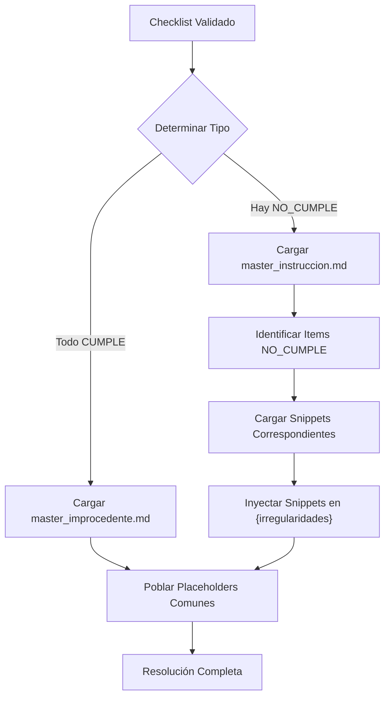

# Capítulo 8: MGR (Motor de Generación Resolutiva)

[← Anterior: Checklist](7_Checklist.md) | [Siguiente: Resolución →](9_Resolucion.md)

## 8.1. Definición y Propósito

El **Motor de Generación Resolutiva (MGR)** es el componente del sistema que genera automáticamente borradores de resoluciones legales basándose en el estado del checklist de validación. El MGR utiliza plantillas dinámicas y fragmentos de argumentos legales para construir resoluciones completas y coherentes.

## 8.2. Principio de Diseño

### 8.2.1. Separación de Contenido y Lógica

El MGR separa:
- **Plantillas (Markdown)**: Contenido legal estructurado
- **Snippets (Markdown)**: Fragmentos de argumentos específicos
- **Lógica de Inyección (Python)**: Cómo combinar plantillas y snippets

### 8.2.2. Ventajas

- **Mantenibilidad**: Cambiar textos legales sin tocar código
- **Consistencia**: Mismos argumentos para mismos casos
- **Escalabilidad**: Fácil agregar nuevos tipos de resoluciones
- **Reutilización**: Snippets compartidos entre plantillas

## 8.3. Sistema de Plantillas

### 8.3.1. Plantillas Master

**Ubicación:** `templates/resolucion/`

**Tipos:**
- `master_instruccion.md`: Plantilla base para cuando se acoge el reclamo
- `master_improcedente.md`: Plantilla base para cuando se rechaza

### 8.3.2. Estructura de Plantilla Master

**Ejemplo: `master_instruccion.md`**

```markdown
# RESOLUCIÓN N° {case_id}

## I. ANTECEDENTES

El día {fecha_ingreso}, el cliente {client_name} (RUT: {rut_client}) 
presentó un reclamo ante la Superintendencia de Electricidad y Combustibles 
respecto de la empresa {empresa}, relacionado con la materia de {materia}.

## II. ANÁLISIS

{irregularidades}

## III. RESOLUCIÓN

Por las razones expuestas, se RESUELVE instruir a la empresa {empresa} 
para que...

Firmado,
Superintendencia de Electricidad y Combustibles
```

**Placeholders:**
- `{case_id}`: ID del caso
- `{client_name}`: Nombre del cliente
- `{rut_client}`: RUT del cliente
- `{empresa}`: Nombre de la empresa
- `{materia}`: Materia del reclamo
- `{fecha_ingreso}`: Fecha de ingreso
- `{irregularidades}`: Lista de irregularidades (inyectada dinámicamente)

### 8.3.3. Snippets de Argumentos

**Ubicación:** `templates/resolucion/snippets/`

**Fragmentos Específicos:**
- `arg_falta_fotos.md`: Argumento para falta de evidencia fotográfica
- `arg_calculo_erroneo.md`: Argumento para cálculo erróneo
- `arg_falta_ot.md`: Argumento para falta de Orden de Trabajo
- `arg_periodo_excesivo.md`: Argumento para período retroactivo excesivo
- `arg_cim_invalido.md`: Argumento para CIM inválido

**Ejemplo: `arg_falta_fotos.md`**

```markdown
- **Falta de Evidencia Fotográfica**: La empresa no ha acreditado mediante 
  evidencia fotográfica el estado del medidor y la instalación, requisito 
  esencial para determinar la existencia de irregularidad según el Artículo 
  X de la Ley General de Servicios Eléctricos.
```

## 8.4. Lógica de Selección de Plantilla

### 8.4.1. Determinación Automática

El MGR determina el tipo de resolución basándose en el estado del checklist:

**Condición para INSTRUCCION:**
- Existe al menos un item crítico en estado ❌ NO_CUMPLE validado por el humano

**Condición para IMPROCEDENTE:**
- Todos los items críticos están en estado ✅ CUMPLE

### 8.4.2. Algoritmo de Decisión

```python
def determine_resolution_type(checklist: Dict) -> str:
    """
    Determina el tipo de resolución basado en el checklist
    """
    # Buscar items NO_CUMPLE validados
    no_cumple_items = []
    
    for group in ['group_a_admisibilidad', 'group_b_instruccion', 'group_c_analisis']:
        for item in checklist.get(group, []):
            if item['status'] == 'NO_CUMPLE' and item.get('validated', False):
                no_cumple_items.append(item)
    
    # Si hay items NO_CUMPLE validados → INSTRUCCION
    if no_cumple_items:
        return 'INSTRUCCION'
    else:
        return 'IMPROCEDENTE'
```

## 8.5. Proceso de Generación

### 8.5.1. Flujo de Generación



### 8.5.2. Algoritmo de Generación

**Entrada:**
- EDN completo con checklist validado
- Tipo de resolución (INSTRUCCION o IMPROCEDENTE)
- Contenido personalizado opcional

**Proceso:**

1. **Cargar Plantilla Master:**
   ```python
   if template_type == "INSTRUCCION":
       master_template = load_template("master_instruccion")
   elif template_type == "IMPROCEDENTE":
       master_template = load_template("master_improcedente")
   ```

2. **Poblar Placeholders Comunes:**
   ```python
   resolucion_content = master_template.format(
       case_id=case_data.get('case_id', 'N/A'),
       client_name=case_data.get('client_name', 'N/A'),
       rut_client=case_data.get('rut_client', 'N/A'),
       empresa=case_data.get('empresa', 'N/A'),
       materia=case_data.get('materia', 'N/A'),
       fecha_ingreso=case_data.get('fecha_ingreso', 'N/A')
   )
   ```

3. **Inyectar Snippets (Solo para INSTRUCCION):**
   ```python
   if template_type == "INSTRUCCION":
       irregularidades_content = []
       
       for item in case_data.get('checklist_failures', []):
           snippet_name = item.get('snippet_ref')
           if snippet_name:
               snippet = load_snippet(snippet_name)
               irregularidades_content.append(snippet)
       
       # Reemplazar placeholder {irregularidades}
       resolucion_content = resolucion_content.replace(
           "{irregularidades}",
           "\n".join(irregularidades_content)
       )
   ```

4. **Agregar Contenido Personalizado (Opcional):**
   ```python
   if custom_content:
       resolucion_content += f"\n\n{custom_content}"
   ```

**Salida:**
- Resolución completa como texto Markdown
- Listo para edición y firma

## 8.6. Mapeo de Items a Snippets

### 8.6.1. Configuración en JSON

Cada item del checklist puede tener un `snippet_ref` que referencia el snippet a inyectar:

```json
{
  "id": "B.2",
  "title": "Existencia de Evidencia Fotográfica",
  "rule_ref": "RULE_CHECK_PHOTOS_EXISTENCE",
  "snippet_ref": "arg_falta_fotos",
  ...
}
```

### 8.6.2. Lógica de Inyección

**Para cada item NO_CUMPLE validado:**
1. Leer `snippet_ref` del item
2. Si existe, cargar snippet correspondiente
3. Agregar a lista de irregularidades
4. Si no existe, usar texto genérico

**Ejemplo:**
- Item B.2 (Falta Fotos) → `snippet_ref: "arg_falta_fotos"` → Carga `arg_falta_fotos.md`
- Item C.2.1 (CIM Inválido) → `snippet_ref: "arg_cim_invalido"` → Carga `arg_cim_invalido.md`

## 8.7. Componente ResolucionGenerator

### 8.7.1. Clase Principal

**Ubicación:** `src/engine/mgr/resolucion_generator.py`

**Métodos:**

#### `load_template(template_name)`
Carga una plantilla master desde `templates/resolucion/`

**Input:** Nombre de template (sin extensión)
**Output:** Contenido del template como string

#### `load_snippet(snippet_name)`
Carga un fragmento de argumento desde `templates/resolucion/snippets/`

**Input:** Nombre de snippet (sin extensión)
**Output:** Contenido del snippet como string (o string vacío si no existe)

#### `generate_resolucion(case_data, template_type, custom_content)`
Genera resolución completa combinando plantilla y snippets

**Input:**
- `case_data`: Diccionario con datos del caso
- `template_type`: "INSTRUCCION" o "IMPROCEDENTE"
- `custom_content`: Contenido adicional opcional

**Output:** Resolución completa como string

### 8.7.2. Ejemplo de Uso

```python
from src.engine.mgr.resolucion_generator import ResolucionGenerator

# Inicializar generador
generator = ResolucionGenerator()

# Datos del caso
case_data = {
    'case_id': '231220-000557',
    'client_name': 'Juan Pérez',
    'rut_client': '12.345.678-9',
    'empresa': 'ENEL',
    'materia': 'Facturación',
    'checklist_failures': [
        {'snippet_ref': 'arg_falta_fotos'},
        {'snippet_ref': 'arg_calculo_erroneo'}
    ]
}

# Generar resolución
resolucion = generator.generate_resolucion(
    case_data=case_data,
    template_type='INSTRUCCION'
)
```

## 8.8. Integración con el Sistema

### 8.8.1. Endpoint de Generación

**Ruta:** `POST /api/casos/{case_id}/resolucion`

**Body:**
```json
{
  "template_type": "INSTRUCCION" | "IMPROCEDENTE"
}
```

**Respuesta:**
```json
{
  "content": "# RESOLUCIÓN N° 231220-000557\n\n..."
}
```

### 8.8.2. Flujo Completo

1. Funcionario valida checklist (Sección C)
2. Funcionario solicita generación de resolución (Sección D)
3. Backend determina tipo de resolución automáticamente
4. MGR genera borrador usando plantillas y snippets
5. Frontend muestra borrador en editor
6. Funcionario puede editar antes de firmar

## 8.9. Ventajas del Sistema de Plantillas

### 8.9.1. Mantenibilidad

- **Cambios Legales**: Actualizar textos legales sin tocar código
- **Nuevos Argumentos**: Agregar snippets sin modificar plantillas
- **Versionado**: Plantillas pueden versionarse independientemente

### 8.9.2. Consistencia

- **Mismos Argumentos**: Mismos casos generan mismos argumentos
- **Formato Uniforme**: Todas las resoluciones siguen mismo formato
- **Completitud**: No se olvidan argumentos relevantes

### 8.9.3. Escalabilidad

- **Nuevos Tipos**: Fácil agregar nuevos tipos de resoluciones
- **Nuevos Snippets**: Agregar argumentos específicos sin tocar código
- **Personalización**: Contenido personalizado opcional

## 8.10. Consideraciones Futuras

### 8.10.1. Plantillas por Tipo de Caso

Actualmente hay plantillas genéricas. Futuro:
- `master_instruccion_cnr.md`: Específica para CNR
- `master_instruccion_corte.md`: Específica para Corte de Suministro

### 8.10.2. Snippets Dinámicos

Actualmente los snippets son estáticos. Futuro:
- Snippets con placeholders dinámicos
- Inyección de datos específicos del caso
- Cálculos automáticos en argumentos

### 8.10.3. Validación Legal

Futuro:
- Validación de que todos los argumentos requeridos estén presentes
- Verificación de coherencia legal
- Sugerencias de mejoras

## 8.11. Conclusión

El MGR transforma el estado del checklist en resoluciones legales completas mediante un sistema de plantillas dinámicas y fragmentos de argumentos. La separación de contenido (Markdown) y lógica (Python) garantiza mantenibilidad y escalabilidad. El sistema determina automáticamente el tipo de resolución y inyecta los argumentos relevantes según los items fallidos del checklist, garantizando consistencia y completitud en las resoluciones generadas.

---

[← Anterior: Checklist](7_Checklist.md) | [Siguiente: Resolución →](9_Resolucion.md)

