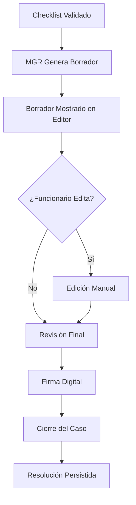

# Capítulo 9: Resolución

[← Anterior: MGR](8_MGR.md) | [Siguiente: Utilidades →](10_Utilidades.md)

## 9.1. Definición y Propósito

La **Resolución** es el producto final del sistema: un documento legal que determina el resultado del reclamo y las acciones que debe tomar la empresa. El proceso de resolución incluye generación automática del borrador, revisión y edición humana, y firma digital que cierra el caso.

## 9.2. Tipos de Resolución

### 9.2.1. Instrucción a la Empresa

**Cuándo se Genera:**
- Existe al menos un item crítico del checklist en estado ❌ NO_CUMPLE validado por el humano

**Contenido:**
- Antecedentes del caso
- Análisis de irregularidades encontradas
- Instrucciones específicas a la empresa
- Plazos y requisitos de cumplimiento

**Objetivo:**
Acoger el reclamo del cliente y ordenar a la empresa que corrija la situación o devuelva el monto cobrado indebidamente.

### 9.2.2. Improcedente

**Cuándo se Genera:**
- Todos los items críticos del checklist están en estado ✅ CUMPLE

**Contenido:**
- Antecedentes del caso
- Análisis de cumplimiento normativo
- Ratificación de que la empresa actuó conforme a norma
- Rechazo del reclamo del cliente

**Objetivo:**
Ratificar que la empresa cumplió con todos los requisitos y rechazar el reclamo del cliente.

## 9.3. Flujo de Generación y Revisión

### 9.3.1. Proceso Completo



### 9.3.2. Generación Automática

**Trigger:**
- Funcionario hace clic en "Generar Borrador" en Sección D
- O automáticamente al cargar la vista de caso

**Proceso:**
1. Backend determina tipo de resolución desde checklist
2. MGR genera borrador usando plantillas y snippets
3. Borrador se muestra en editor de texto

**Características:**
- Reemplaza contenido anterior si existe
- Basado en estado actual del checklist
- Incluye todos los argumentos relevantes

### 9.3.3. Edición Manual

**Capacidades del Editor:**
- Textarea grande (15 filas) para editar contenido
- Edición libre del texto generado
- Agregar párrafos adicionales
- Modificar argumentos
- Corregir errores automáticos

**Principio:**
El funcionario tiene control total sobre el contenido final. El borrador generado es una ayuda, no una restricción.

## 9.4. Interfaz de Usuario: Sección D

### 9.4.1. Componentes Visuales

**Selector de Tipo de Resolución:**
- Dropdown: "Instrucción a la Empresa" o "Improcedente"
- Botón "Generar Borrador"
- Permite cambiar tipo y regenerar

**Editor de Resolución:**
- Textarea grande con scroll
- Contenido editable
- Auto-genera borrador al cargar
- Reemplaza contenido al cambiar tipo o generar nuevo borrador

**Botón "Firmar y Cerrar Caso":**
- Valida que haya contenido
- Muestra confirmación
- Estado de carga durante cierre

### 9.4.2. Flujo de Interacción

1. **Carga Inicial:**
   - Sistema auto-genera borrador basado en checklist
   - Muestra en editor

2. **Cambio de Tipo:**
   - Funcionario cambia tipo en dropdown
   - Sistema regenera borrador
   - Reemplaza contenido del editor

3. **Edición:**
   - Funcionario edita texto libremente
   - Cambios se mantienen en memoria
   - No se persisten hasta firmar

4. **Firma:**
   - Funcionario revisa borrador final
   - Hace clic en "Firmar y Cerrar Caso"
   - Sistema valida y cierra caso

## 9.5. Validaciones Pre-Firma

### 9.5.1. Validaciones Obligatorias

**Contenido No Vacío:**
- La resolución debe tener al menos 100 caracteres
- No puede ser solo espacios en blanco

**Confirmación del Usuario:**
- Diálogo de confirmación antes de cerrar
- Mensaje: "¿Está seguro de que desea firmar y cerrar este caso?"

### 9.5.2. Validaciones Opcionales (Futuro)

**Coherencia Legal:**
- Verificar que argumentos sean consistentes
- Detectar contradicciones

**Completitud:**
- Verificar que todos los items NO_CUMPLE tengan argumento
- Sugerir argumentos faltantes

## 9.6. Firma Digital y Cierre

### 9.6.1. Proceso de Firma

**Entrada:**
- Resolución editada y aprobada
- Confirmación del funcionario

**Proceso:**
1. Validar contenido de resolución
2. Generar timestamp de firma
3. Actualizar estado del caso a `CERRADO`
4. Guardar resolución en EDN
5. Guardar fecha de cierre
6. Persistir en base de datos

**Salida:**
- Caso cerrado con resolución final
- Estado actualizado en base de datos
- Redirección al Dashboard

### 9.6.2. Persistencia de Resolución

**Estructura en EDN:**
```json
{
  "resolucion": {
    "content": "# RESOLUCIÓN N° 231220-000557\n\n...",
    "tipo": "INSTRUCCION",
    "fecha_firma": "2024-01-15T10:30:00Z",
    "firmado_por": "funcionario_id"
  }
}
```

**Almacenamiento:**
- Resolución completa en `edn.json`
- Metadatos en `casos.json` (fecha_cierre, estado)

### 9.6.3. Generación de PDF (Futuro)

**Proceso Futuro:**
1. Convertir Markdown a PDF
2. Aplicar formato legal estándar
3. Agregar firma digital
4. Guardar PDF en sistema de archivos
5. Notificar a sistemas externos

## 9.7. Actualización de Estado del Caso

### 9.7.1. Estados del Caso

**PENDIENTE:**
- Caso recién ingresado
- No ha sido revisado

**EN_REVISION:**
- Funcionario está revisando
- Checklist en proceso de validación

**RESUELTO:**
- Checklist validado
- Resolución generada pero no firmada

**CERRADO:**
- Resolución firmada
- Caso finalizado

### 9.7.2. Transición de Estados

**Flujo Normal:**
```
PENDIENTE → EN_REVISION → RESUELTO → CERRADO
```

**Actualización al Firmar:**
- Estado cambia a `CERRADO`
- `fecha_cierre` se establece
- Resolución se persiste

## 9.8. Trazabilidad y Auditoría

### 9.8.1. Información de Auditoría

**Datos Capturados:**
- Fecha y hora de firma
- Usuario que firmó (futuro con autenticación)
- Versión de la resolución
- Historial de ediciones (futuro)

### 9.8.2. Inmutabilidad Post-Cierre

**Principio:**
Una vez cerrado, el caso no debe modificarse. Cualquier cambio requiere:
- Reapertura autorizada
- Justificación
- Registro de auditoría

**Implementación Futura:**
- Permisos de solo lectura para casos cerrados
- Proceso de reapertura con aprobación
- Historial completo de cambios

## 9.9. Integración con Sistemas Externos

### 9.9.1. Notificación de Cierre

**Futuro:**
- Webhook a sistema SIAC
- Notificación por email
- Actualización en sistema de gestión

### 9.9.2. Exportación de Resoluciones

**Formatos Futuros:**
- PDF con formato legal
- XML estructurado
- Integración con sistema de archivo

## 9.10. Casos Especiales

### 9.10.1. Resolución Parcial

**Escenario:**
Algunos items CUMPLE, otros NO_CUMPLE, pero no todos son críticos.

**Manejo:**
- MGR genera resolución de INSTRUCCION
- Incluye solo argumentos de items críticos NO_CUMPLE
- Funcionario puede agregar contexto adicional

### 9.10.2. Rechazo por Admisibilidad

**Escenario:**
Grupo A (Admisibilidad) tiene items NO_CUMPLE.

**Manejo:**
- Caso puede cerrarse sin análisis profundo
- Resolución breve explicando motivo de rechazo
- No requiere análisis de fondo

## 9.11. Conclusión

La resolución es el producto final que transforma el análisis automatizado en una decisión legal ejecutable. El proceso combina generación automática inteligente con revisión y edición humana, garantizando precisión legal mientras maximiza eficiencia. La firma digital marca el cierre formal del caso, preservando la resolución y actualizando el estado en el sistema. El sistema de resolución garantiza consistencia, completitud y trazabilidad en todas las decisiones tomadas.

---

[← Anterior: MGR](8_MGR.md) | [Siguiente: Utilidades →](10_Utilidades.md)

