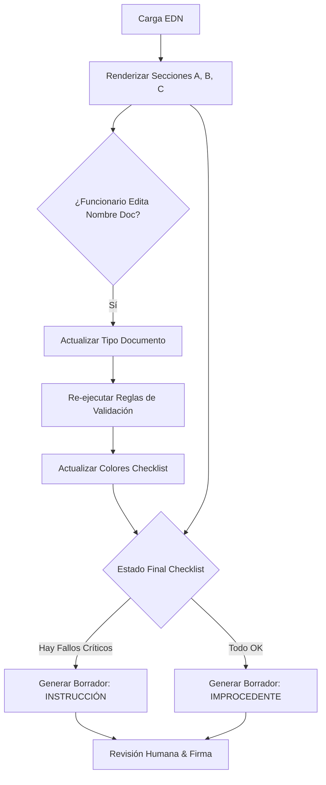

## 3. Motor de Ingesta, Compilación y Persistencia de Entidades

### 3.1. Visión General del Módulo

Este componente actúa como la puerta de entrada al sistema ("Caja Negra"). Su responsabilidad es recibir datos no estructurados (archivos PDF, imágenes, excels) y metadatos dispersos, procesarlos mediante técnicas de OCR y NLP, y transformarlos en dos salidas críticas:

1.  **Persistencia Relacional:** Creación o actualización inteligente de perfiles en la Base de Datos (Clientes, Suministros, Casos).
2.  **Expediente Digital Normalizado (EDN):** Un objeto JSON estandarizado que sirve como *input* único para los módulos de análisis posteriores.

-----

### 3.2. Sub-módulo de Ingesta y Normalización (The Black Box)

El proveedor deberá implementar un pipeline de procesamiento capaz de recibir un lote arbitrario de archivos asociados a un ID de Caso SEC y devolver un inventario estructurado.

#### 3.2.1. Requerimientos de Entrada (Input)

El sistema deberá exponer un *endpoint* o *watcher* que acepte:

  * **Case Metadata:** ID del Caso (SEC/SIAC), Origen, Fecha de Ingreso.
  * **File Batch:** Conjunto de archivos binarios (PDF, JPG, PNG, XLSX). No se garantiza nomenclatura estandarizada en los nombres de archivo originales.

#### 3.2.2. Lógica de Procesamiento (Pipeline)

El algoritmo ejecutará secuencialmente:

1.  **Sanitización:** Reparación de cabeceras PDF corruptas y conversión de formatos propietarios a estándares abiertos (PDF/A o Texto Plano).
2.  **OCR & Extracción de Texto:**
      * Si el documento es imagen, aplicar OCR con soporte para idioma español.
      * Si es PDF nativo, extracción directa de capa de texto.
3.  **Clasificación Documental:** Identificación del tipo de documento mediante heurística de contenido (Palabras clave, estructura visual).
      * *Taxonomía mínima requerida:* `CARTA_RESPUESTA`, `ORDEN_TRABAJO`, `TABLA_CALCULO`, `EVIDENCIA_FOTOGRAFICA`, `GRAFICO_CONSUMO`.
4.  **Extracción de Entidades Maestras:** Localización de RUTs, Números de Cliente (NIS), Direcciones y Montos.

#### 3.2.3. Contrato de Salida: Expediente Digital Normalizado (EDN)

El sistema generará un objeto JSON que servirá como **Contrato de Datos** para el resto del flujo. Este objeto debe cumplir estrictamente el siguiente esquema:

```json
{
  "compilation_metadata": {
    "case_id": "String (Unique ID)",
    "processing_timestamp": "ISO8601",
    "status": "COMPLETED"
  },
  "unified_context": {
    "rut_client": "String (Normalized 12.345.678-9)",
    "client_name": "String",
    "service_nis": "String (Critical for Asset Tracking)",
    "address_standard": "String",
    "commune": "String"
  },
  "document_inventory": {
    "level_1_critical": [
      {
        "type": "CARTA_RESPUESTA",
        "file_id": "UUID_interno_storage",
        "original_name": "Respuesta_Cliente.pdf",
        "extracted_data": { "response_date": "YYYY-MM-DD", "decision": "REJECTED" }
      },
      {
        "type": "TABLA_CALCULO",
        "file_id": "UUID_interno_storage",
        "extracted_data": { "total_amount": 150000, "cim_kwh": 450 }
      }
    ],
    "level_2_supporting": [
      {
        "type": "EVIDENCIA_FOTOGRAFICA",
        "file_id": "UUID_interno_storage",
        "metadata": { "quantity": 3, "tags": ["medidor", "sello_roto"] }
      }
    ],
    "level_0_missing": [
      {
        "required_type": "ORDEN_TRABAJO",
        "alert_level": "HIGH",
        "description": "No se detectó documento técnico de terreno."
      }
    ]
  }
}
```

-----

### 3.3. Estrategia de Persistencia de Datos (Database Logic)

Este sub-módulo es responsable de guardar la historia. No debe limitarse a registrar el reclamo, sino que debe construir el perfilamiento histórico de los actores involucrados.

#### 3.3.1. Modelo de Datos (Esquema Estrella)

El sistema deberá poblar un modelo relacional centrado en el **CASO**, pero soportado por entidades satélites persistentes.

  * **Entidad PERSONA (Clientes):** Identificada únicamente por RUT. Almacena historial de contacto.
  * **Entidad SUMINISTRO (Activo Físico):** Identificada por NIS/N° Cliente + Comuna. Esta entidad es crítica para detectar reincidencia de fraudes en una ubicación física, independientemente del habitante.
  * **Entidad CASO:** El evento temporal que vincula a una Persona, un Suministro y una Empresa en un momento dado.

#### 3.3.2. Lógica de Inserción Inteligente (Upsert Strategy)

Al procesar un nuevo caso, el sistema **no debe duplicar** entidades existentes. Deberá aplicar la siguiente lógica:

1.  **Resolución de PERSONA:**
      * *Input:* RUT extraído del EDN.
      * *Lógica:* Buscar RUT en tabla `PERSONAS`.
          * *Si existe:* Actualizar datos de contacto (Email/Teléfono) si los nuevos son más recientes. Obtener `Persona_ID`.
          * *Si no existe:* Crear nuevo registro de Persona.
2.  **Resolución de SUMINISTRO (Asset):**
      * *Input:* NIS y Comuna extraídos del EDN.
      * *Lógica:* Buscar NIS en tabla `SUMINISTROS`.
          * *Si existe:* Vincular caso a este `Suministro_ID`. (Esto permite ver el historial de problemas de ese medidor/casa).
          * *Si no existe:* Crear nuevo Punto de Suministro georreferenciado.
3.  **Registro del CASO:**
      * Crear registro en tabla `RECLAMOS` vinculando `Persona_ID` y `Suministro_ID`.
4.  **Indexación Documental:**
      * Insertar registros en tabla `DOCUMENTOS` para cada archivo del inventario, guardando su `file_id`, `type` y el bloque `extracted_data` como un campo JSONB (para consultas analíticas futuras).

-----

### 3.4. Criterios de Aceptación del Módulo

Para dar por aprobado este componente, el sistema debe cumplir:

1.  **Idempotencia:** Si se procesa el mismo set de archivos dos veces, no se deben duplicar los registros en la base de datos (debe actualizar o ignorar).
2.  **Tolerancia a Fallos:** Si un archivo opcional es ilegible, el proceso no debe detenerse; debe marcarlo en `level_0_missing` y continuar.
3.  **Integridad Referencial:** Todo Caso creado debe estar obligatoriamente vinculado a una Persona y un Suministro.


Esta es una estructura sólida y muy funcional. El punto clave que has añadido es la **capacidad de edición del funcionario (Renombrar)**, lo cual es vital: si el algoritmo se equivoca y clasifica una "Orden de Trabajo" como "Otros", el funcionario lo corrige manualmente, y el sistema debe ser lo suficientemente inteligente para decir *"¡Ah\! Ahora sí tengo la Orden de Trabajo"* y actualizar el Checklist de rojo a verde automáticamente.

Aquí tienes la redacción técnica para el **Módulo 4 (Interfaz de Usuario)** de tu Manual, integrando esta lógica reactiva.

-----

## 4. Interfaz de Resolución y Control (Front-End)

### 4.1. Visión General del Módulo

Este componente proporciona la capa de interacción humano-máquina. Su diseño responde al paradigma de **"Gestión por Excepción"**, presentando la información procesada de manera jerárquica y progresiva.

El objetivo es minimizar la carga cognitiva del funcionario, centralizando la revisión en una única pantalla ("Single Page Application") dividida en cuatro secciones funcionales interconectadas.

-----

### 4.2. Sección A: Resumen de Contexto (Header)

> **Propósito:** Proporcionar orientación inmediata sobre el caso sin necesidad de navegación.

  * **Fuente de Datos:** Objeto `unified_context` del EDN (Expediente Digital Normalizado).
  * **Elementos Visuales (Read-Only):**
      * **Tarjeta del Cliente:** Nombre, RUT, Datos de Contacto Normalizados.
      * **Tarjeta del Suministro:** Dirección, Comuna (Clave para zona tarifaria), N° Cliente/NIS.
      * **Tarjeta del Caso:** ID SEC, Materia (ej: Facturación), Monto en Disputa ($).
      * **Indicadores de Alerta:** Etiquetas visuales para casos especiales (ej: "Electrodependiente", "Reincidente", "Zona de Conflicto").

-----

### 4.3. Sección B: Gestor Documental Inteligente (Docs)

> **Propósito:** Listar la evidencia disponible, permitir su visualización y corregir la clasificación automática del algoritmo.

  * **Funcionalidad de Listado:**

      * Despliegue de archivos agrupados por relevancia (`Nivel 1 Críticos`, `Nivel 2 Soportantes`, `Nivel 0 Ausentes`).
      * Visualización del `standardized_name` (asignado por la IA) junto al `original_filename`.
      * **Acción Click:** Abre el documento en un visor lateral (Split View) sin salir del flujo.

  * **Funcionalidad de Re-Clasificación (Human Feedback Loop):**

      * **Edición:** El funcionario puede cambiar el `standardized_name` mediante un menú desplegable con la taxonomía oficial (ej: Cambiar de "Documento Genérico" a "Tabla de Cálculo").
      * **Reactividad del Sistema:** Al guardar un cambio de nombre:
        1.  El sistema actualiza el atributo `type` en el inventario del EDN.
        2.  **Re-evaluación en Tiempo Real:** Se dispara un evento que recalcula el estado del Checklist (Sección C).
              * *Ejemplo:* Si el Checklist marcaba "Falta Tabla de Cálculo" (❌) y el funcionario etiqueta un archivo como tal, el Checklist debe actualizarse inmediatamente a "Cumple" (✅).

-----

### 4.4. Sección C: Checklist de Validación Expandible

> **Propósito:** El núcleo de la decisión. Presenta las reglas de negocio evaluadas por el algoritmo, organizadas en tres grupos secuenciales que condicionan el siguiente.

  * **Estados Visuales:**

      * ✅ **Cumple (Verde):** Evidencia encontrada y consistente.
      * ❌ **No Cumple / Faltante (Rojo):** Evidencia crítica ausente o datos inconsistentes.
      * ⚠️ **Revisión Manual (Amarillo):** Confianza del algoritmo baja (\<70%) o regla subjetiva.

  * **Interacción "Expandir para Ver":**

      * Cada línea del checklist es colapsable.
      * Al expandir, muestra la **Evidencia Específica** (Snippet):
          * *Si es Dato:* Muestra el valor extraído vs. el valor esperado.
          * *Si es Archivo:* Muestra un enlace directo a la página específica del PDF donde se halló el dato.
      * **Controles de Validación:** Checkboxes para que el funcionario confirme o anule el hallazgo de la IA.

  * **Estructura de Validación (Para Casos CNR - Recuperación de Consumo):**

      El sistema implementa tres grupos de validación secuencial. El estado de cada grupo condiciona el siguiente (ej: si falla Admisibilidad, no se evalúa el Fondo).

      #### Grupo A: Etapa de Admisibilidad y Forma

      > **Objetivo:** Verificar que se cumplan los requisitos administrativos y plazos legales antes de entrar al fondo del asunto.

      * **A.1. Validación de Plazo de Respuesta**

          * **Regla:** `Fecha_Respuesta_Empresa` - `Fecha_Reclamo_Cliente` ≤ 30 días corridos.
          * **Visualización:**
              * ✅ "En Plazo (15 días)"
              * ❌ "Fuera de Plazo (45 días) - **Causal de Instrucción Inmediata**"
          * **Fuente:** Metadatos del Caso SEC vs. Fecha extraída de la Carta de Respuesta.

      * **A.2. Trazabilidad del Reclamo Previo**

          * **Regla:** Existe un `ID_Reclamo_Interno` citado en la Carta de Respuesta que vincula el caso.
          * **Visualización:**
              * ✅ "Vinculación Correcta (Ticket #6463468)"
              * ⚠️ "No se detecta referencia a reclamo previo"

      * **A.3. Competencia de la Materia**

          * **Regla:** La materia clasificada (`CNR`) coincide con los documentos adjuntos (OT de Irregularidad).
          * **Visualización:**
              * ✅ "Coherencia Documental (Mat: CNR)"
              * ❌ "Incoherencia: Materia 'Corte de Luz' pero documentos son de 'Cobro'"

      #### Grupo B: Etapa de Instrucción (Integridad Probatoria)

      > **Objetivo:** Verificar que la empresa (el "instruido") haya aportado todas las piezas del expediente exigidas por el Oficio de la SEC.

      * **B.1. Existencia de Orden de Trabajo (OT)**

          * **Regla:** `EDN.document_inventory.level_1_critical` contiene `TIPO: ORDEN_TRABAJO`.
          * **Visualización:**
              * ✅ "OT Adjunta (Folio 197803311)"
              * ❌ "Falta OT - **Imposible acreditar hecho**"

      * **B.2. Existencia de Evidencia Fotográfica**

          * **Regla:** `EDN.document_inventory.level_2_supporting` contiene `TIPO: EVIDENCIA_FOTOGRAFICA` con `cantidad >= 1`.
          * **Visualización:**
              * ✅ "Set Fotográfico (3 imágenes)"
              * ⚠️ "Fotos insuficientes o de baja calidad (OCR confidence < 50%)"
              * ❌ "Sin evidencia visual"

      * **B.3. Existencia de Memoria de Cálculo**

          * **Regla:** `EDN.document_inventory.level_1_critical` contiene `TIPO: TABLA_CALCULO`.
          * **Visualización:**
              * ✅ "Tabla Detallada Disponible"
              * ❌ "Falta desglose de deuda"

      * **B.4. Acreditación de Notificación**

          * **Regla:** Búsqueda de palabras clave ("Carta Certificada", "Notificación Personal", "Firma") en los documentos adjuntos.
          * **Visualización:**
              * ✅ "Cliente Notificado (Ref: Carta Certificada)"
              * ⚠️ "No se acredita entrega de notificación de cobro"

      #### Grupo C: Etapa de Análisis Técnico-Jurídico (Fondo del Asunto)

      > **Objetivo:** Cruzar los datos extraídos para validar la legalidad del cobro. Esta es la etapa más compleja y requiere "Inteligencia Lógica".

      ##### Sub-checklist C.1: Acreditación del Hecho (El Fraude)

      * **C.1.1. Consistencia del Hallazgo**

          * **Regla:** La descripción en la OT ("Sello Roto") coincide con las etiquetas de la IA en las Fotos ("broken_seal").
          * **Visualización:**
              * ✅ "Hallazgo Coherente: Sello Adulterado"
              * ❌ "Contradicción: OT dice 'Intervención' pero fotos muestran medidor normal"

      * **C.1.2. Prueba de Exactitud (Laboratorio)**

          * **Regla:** Si se cambió el medidor, ¿existe Certificado de Calibración o prueba in-situ en la OT?
          * **Visualización:**
              * ✅ "Prueba In-Situ: Error -81%" [cite: página 211 del PDF]
              * ⚠️ "No se adjunta prueba de error de medida"

      ##### Sub-checklist C.2: Legalidad del Cobro (Las Matemáticas)

      * **C.2.1. Validación del CIM (Consumo Índice Mensual)**

          * **Regla:** Compara el `CIM_Aplicado` (del Excel/Tabla de Cálculo) vs. `Promedio_Historico_Cliente` (de la Base de Datos de Suministros).
          * **Tolerancia:** Alerta si `CIM` > 150% del `Promedio`.
          * **Visualización:**
              * ✅ "CIM Razonable (623 kWh vs Histórico 600 kWh)"
              * ❌ "CIM Desproporcionado (623 kWh vs Histórico 150 kWh)"

      * **C.2.2. Periodo Retroactivo**

          * **Regla:** `Fecha_Fin_Cobro` - `Fecha_Inicio_Cobro` ≤ 12 meses (Norma general).
          * **Visualización:**
              * ✅ "Periodo Normativo (12 meses)" [cite: página 154 del PDF]
              * ❌ "Cobro Excesivo (>12 meses retroactivos)"

      * **C.2.3. Corrección Monetaria**

          * **Regla:** Verifica que el valor del kWh usado corresponda a la tarifa vigente en la fecha del cobro.
          * **Visualización:**
              * ✅ "Tarifa Vigente Aplicada"
              * ⚠️ "Posible error en valor unitario kWh"

  * **Nota para el Desarrollador:**

      > **Importante:** Estos checklists no son estáticos. Son **vistas renderizadas** del resultado del procesamiento del JSON `EDN`.

      > * Si el JSON dice `missing_evidence: ["FOTOS"]`, el ítem **B.2** se renderiza automáticamente en **ROJO** y bloquea la opción de "Improcedente".

      > * El funcionario tiene la facultad de **Sobreescribir (Override)** cualquiera de estos estados si la IA comete un error, dejando un registro de auditoría de quién forzó el cambio y por qué.

-----

### 4.5. Sección D: Motor de Resolución y Respuesta

> **Propósito:** Generar el dictamen legal final basándose en el estado consolidado del Checklist.

  * **Lógica de Selección de Plantilla (Template Engine):**
    El sistema pre-seleccionará el tipo de resolución según el estado de los indicadores críticos de la Sección C:

      * **Escenario 1: Rechazo del Reclamo (Instrucción a la Empresa)**

          * *Condición:* Si existe al menos un indicador crítico en estado ❌ (Rojo) validado por el humano (ej: "Cálculo Erróneo", "Falta Evidencia").
          * *Acción:* Cargar **Template de Instrucción**.
          * *Inyección de Contenido:* El cuerpo del documento se autocompleta con párrafos argumentativos correspondientes a cada ítem fallido.
              * *Variable:* `{argumento_legal_1}` = "La empresa no acreditó la irregularidad según Art. X..." (Insertado porque faltan fotos).

      * **Escenario 2: Aprobación del Reclamo (Improcedente)**

          * *Condición:* Todos los indicadores críticos están en estado ✅ (Verde).
          * *Acción:* Cargar **Template de Improcedencia**.
          * *Contenido:* Texto estándar ratificando que la empresa actuó conforme a norma.

  * **Editor Final:**

      * Área de texto enriquecido donde el funcionario puede pulir el borrador generado automáticamente.
      * Botón **"Firmar y Cerrar Caso"**: Genera el PDF final, lo guarda en el repositorio y notifica al sistema central.

-----

### Diagrama de Flujo de la Interfaz (Para referencia del desarrollador)

